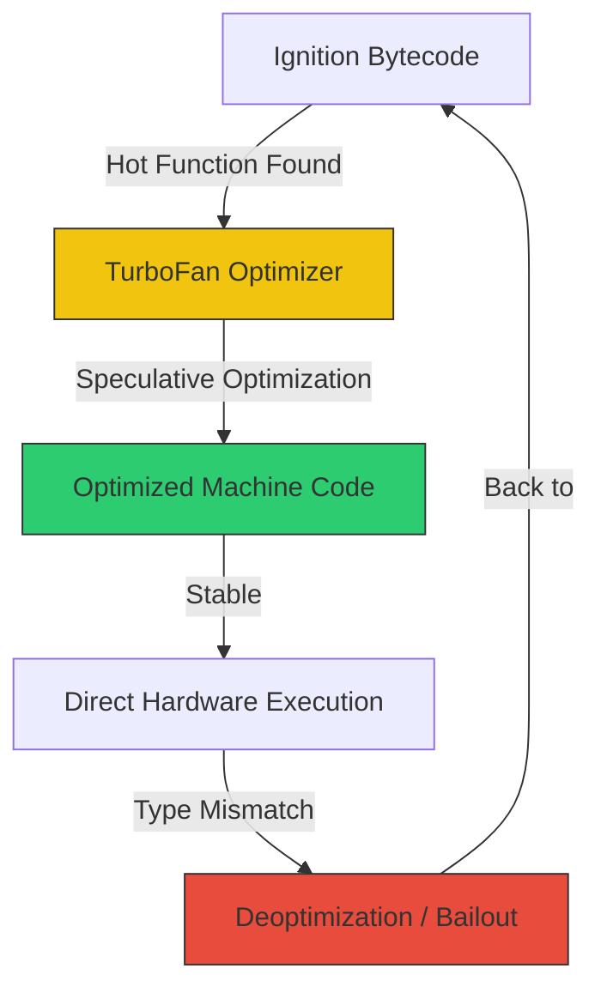

# CH-03: TurboFan (The Optimizing Compiler)

TurboFan adalah "senjata rahasia" V8 yang mengubah JavaScript menjadi kode mesin yang sangat efisien, setara dengan performa C++ melalui teknik **Just-In-Time (JIT) Compilation**.

## 🚀 Optimization Cycle
V8 tidak mengoptimasi semua kode, melainkan hanya kode yang dianggap "Hot" (sering dipanggil).

## 🛠️ Speculative Optimization
TurboFan menggunakan **Feedback Data** dari Ignition untuk membuat asumsi cerdas (Spekulasi). 
- Jika Ignition mencatat bahwa fungsi `add(a, b)` selalu menerima `Number`, TurboFan akan membuat kode mesin yang langsung melakukan operasi penambahan bit tanpa melakukan pemeriksaan tipe data (type checking) lagi.
- Ini menghilangkan overhead yang biasanya membuat bahasa dinamis terasa lambat.

## 🌊 Sea-of-Nodes
Di balik layar, TurboFan merepresentasikan kode Anda dalam bentuk **Sea-of-Nodes**. Berbeda dengan AST yang berbentuk pohon kaku, Sea-of-Nodes adalah representasi grafik yang memungkinkan optimizer untuk melakukan:
1. **Dead Code Elimination**: Menghapus kode yang tidak pernah dieksekusi.
2. **Inlining**: Memasukkan isi fungsi kecil langsung ke tempat pemanggilannya untuk mengurangi overhead call stack.
3. **Constant Folding**: Menghitung hasil operasi statis (misal `2 + 3`) saat kompilasi.

## ⚠️ Deoptimization (The Bailout)
Jika spekulasi TurboFan salah (misal: fungsi `add` tiba-tiba dipanggil dengan `String`), V8 akan melakukan **Deoptimization**. Kode mesin yang cepat akan dibuang, dan eksekusi dipindahkan kembali ke **Ignition Interpreted Bytecode**. 

> [!CAUTION]
> **Performance Killer**: Terlalu sering memicu deoptimasi (misal dengan mengganti-ganti tipe parameter fungsi) akan membuat V8 menyerah untuk mengoptimasi fungsi tersebut, atau biasa disebut sebagai **Optimization Hell**.

---
*Lihat Lab: [Tes Optimasi](./examples/optimization_test.js)*  
*Kembali ke [BK-01](../README.md)*
