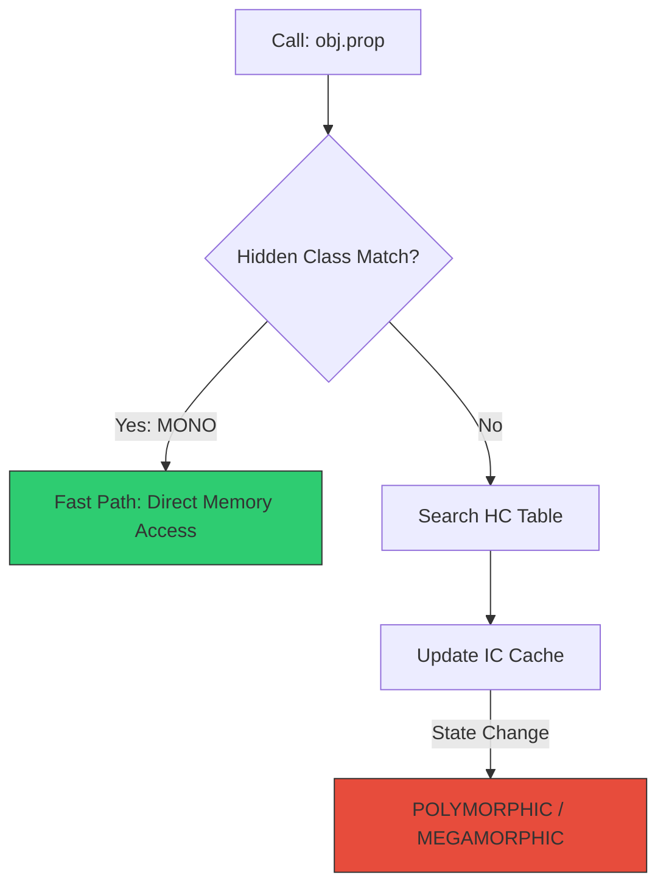

# CH-02: Inline Caches (ICs)

**Inline Caches (ICs)** adalah mekanisme krusial yang digunakan V8 untuk mempercepat akses properti objek dengan cara "mengingat" hasil pencarian sebelumnya.

## 🚀 Mekanisme Kerja
Tanpa IC, setiap kali Anda memanggil `obj.x`, V8 harus mencari nama `x` di dalam Hidden Class, menemukan offset memorinya, baru mengambil nilainya. IC memotong jalur ini.

## 📊 Status IC (States)
V8 mengategorikan optimasi akses berdasarkan variasi objek yang masuk ke sebuah fungsi:

1. **Monomorphic**: Fungsi hanya menerima satu jenis Hidden Class. V8 bisa melakukan optimasi maksimal (Inlining). Sangat Cepat.
2. **Polymorphic**: Fungsi menerima 2 hingga 4 jenis Hidden Class yang berbeda. V8 menggunakan *small cache table*. Cukup Cepat.
3. **Megamorphic**: Fungsi menerima lebih dari 4 jenis Hidden Class. V8 menyerah pada cache lokal dan menggunakan *Global Lookup Table*. Lambat.

## 💎 The Feedback Vector
Data tentang status IC ini disimpan dalam **Feedback Vector** (seperti yang kita bahas di [SR-01/CH-02](../../SR-01_V8Architecture/BK-01_ThePipeline/CH-02_Ignition/README.md)). TurboFan akan membaca Feedback Vector ini:
- Jika statusnya **Monomorphic**, TurboFan akan melakukan *Hard-coding* alamat memori properti tersebut.
- Jika **Megamorphic**, TurboFan tidak akan melakukan optimasi khusus.

> [!TIP]
> **Performance Strategy**: Usahakan fungsi Anda sesering mungkin bersifat **Monomorphic**. Artinya, buatlah fungsi yang menerima objek dengan "Shape" (Hidden Class) yang konsisten.

---
*Lihat Lab: [Benchmark Performa IC](./examples/ic_performance.js)*  
*Kembali ke [BK-01](../README.md)*
