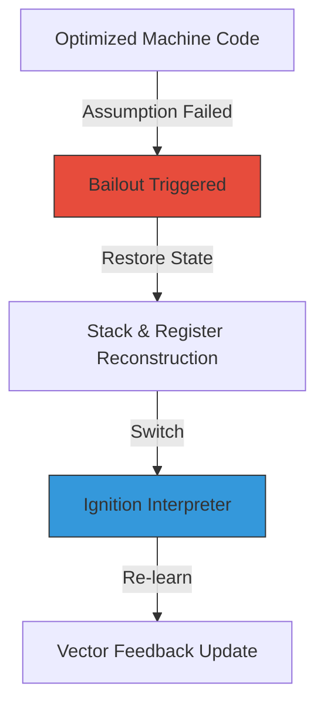

# CH-03: Deoptimization (The Bailout)

**Deoptimization** (sering disebut **Bailout**) adalah mekanisme pertahanan V8 ketika asumsi optimasi yang dibuat oleh TurboFan terbukti salah saat runtime.

## 📉 The Bailout Process
Ketika deoptimasi terjadi, engine harus menghentikan eksekusi kode mesin yang dioptimasi dan kembali ke interpreter.

## 🔍 Mengapa Deoptimasi Terjadi?
JavaScript adalah bahasa yang sangat dinamis. TurboFan melakukan **Speculative Optimization** berdasarkan data masa lalu. Deoptimasi dipicu jika:
1. **Type Change**: Variabel yang biasanya `Number` tiba-tiba menerima `String`.
2. **Shape Change**: Objek yang masuk ke fungsi memiliki Hidden Class yang belum pernah dilihat sebelumnya.
3. **Array Consistency**: Array yang biasanya berisi angka (Smi) tiba-tiba berisi objek atau `undefined` (Holey Array).

## 🚀 Jenis Deoptimasi
- **Eager Deoptimization**: Terjadi tepat saat instruksi yang salah dijalankan (misal: penambahan ternyata bukan angka).
- **Lazy Deoptimization**: Terjadi ketika fungsi sudah selesai dijalankan, namun saat kembali ke pemanggilnya, lingkungan sudah berubah (misal: ada kode yang mengubah struktur objek secara global).

> [!WARNING]
> **Performance Hit**: Deoptimasi sangat mahal! Engine harus membangun ulang stack frame dan register agar sesuai dengan kebutuhan interpreter. Jika sebuah fungsi sering "Bouncing" antara optimasi dan deoptimasi, performanya akan anjlok drastis.

---
*Lihat Lab: [Pemicu Deoptimasi](./examples/deopt_trigger.js)*  
*Kembali ke [BK-01](../README.md)*
