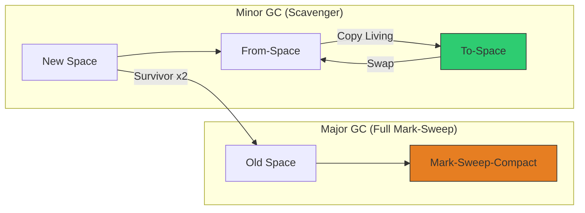

# CH-02: Generational Garbage Collection

V8 menggunakan strategi **Generational Garbage Collection** yang didasarkan pada hipotesis bahwa "sebagian besar objek mati dalam waktu singkat".

## 🔄 The GC Cycle
V8 membagi proses pembersihan menjadi dua mekanisme utama berdasarkan umur objek.

## 🧹 Minor GC (The Scavenger)
Minor GC bekerja sangat cepat di **New Space**.
1. **Cheney's Algorithm**: Membagi New Space menjadi dua bagian: *From-Space* dan *To-Space*.
2. **Mechanism**: Saat *From-Space* penuh, V8 menyisir objek yang masih hidup dan menyalinnya ke *To-Space*. Sisanya (sampah) dibuang seketika.
3. **Promotion**: Objek yang lolos dari 2 kali siklus Scavenger akan dipromosikan (dipindahkan) ke **Old Space**.

## 🏗️ Major GC (Mark-Sweep-Compact)
Major GC bekerja di **Old Space** dan dijalankan lebih jarang karena memakan waktu lebih lama.
- **Marking**: Melacak grafik objek dari *Roots* (Window/Global) untuk menandai mana yang masih hidup.
- **Sweeping**: Menghapus objek yang tidak ditandai.
- **Compacting**: Menggeser objek yang tersisa agar memori tidak terfragmentasi (berlubang-lubang).

> [!TIP]
> **Orinoco Project**: V8 modern melakukan GC secara **Parallel**, **Incremental**, dan **Concurrent** di latar belakang sehingga "World-Stop" (jeda total) hampir tidak terasa lagi bagi pengguna.

---
*Lihat Lab: [Observasi GC](./examples/gc_observer.js)*  
*Kembali ke [BK-01](../README.md)*
