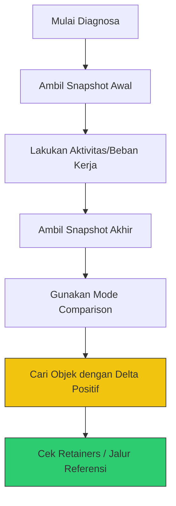

# CH-03: Memory Tools (Diagnostic Guide)

Memahami teori manajemen memori tidaklah cukup tanpa kemampuan untuk mendiagnosa masalah nyata seperti **Memory Leaks**.

## 🛠️ Essential Tools
V8 menyediakan kait (hooks) bagi developer untuk melihat isi heap secara real-time.

1. **Chrome DevTools (Memory Tab)**: Standar industri untuk profiling.
2. **Node --inspect**: Menghubungkan script Node.js ke debugger Chrome.
3. **Heap Snapshots**: Mengambil potret memori di satu titik waktu.
4. **Allocation Instrumentation**: Melihat objek mana yang baru dialokasikan secara terus-menerus.

## 🔎 Hunting for Leaks
Langkah sistematis untuk menemukan kebocoran memori:

## 🚩 Red Flags (Kapan Harus Khawatir?)
- **Sawtooth Pattern**: Grafik memori naik lalu turun tajam (Normal, GC sedang bekerja).
- **Staircase Pattern**: Grafik memori terus naik tanpa pernah turun (Indikasi kuat **Memory Leak**).
- **RSS vs Heap**: Jika RSS membusung jauh lebih besar dari Heap, kemungkinan ada kebocoran di level C++ (Node.js internal).

> [!TIP]
> **Pro-Tip**: Gunakan flag `--trace-gc` untuk melihat frekuensi dan durasi pembersihan memori. Jika GC berjalan setiap detik dan memakan waktu >100ms, aplikasi Anda sedang dalam tekanan memori tinggi.

---
*Lihat Lab: [Simulasi Kebocoran](./examples/leak_simulation.js)*  
*Kembali ke [BK-01](../README.md)*
