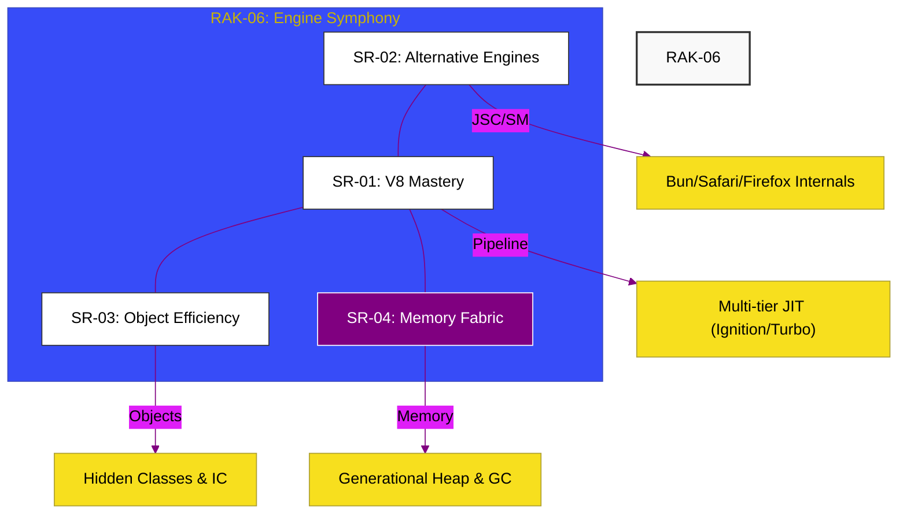

# RAK-06: Engines & Internals (The Engine Symphony)

> **"Simfoni Digital: Membedah Jantung Mekanis JavaScript yang Mengubah Teks Mentah Menjadi Performa Komputasi Tingkat Tinggi."**

---

## 🌓 1. Essence: The Narrative

### Dual Definition
- **Formal**: Rak puncak dalam arsitektur repositori yang didedikasikan untuk mempelajari cara kerja internal mesin JavaScript modern (**V8**, **JSC**, **SpiderMonkey**). Mencakup mekanisme kompilasi bertingkat, optimasi tipe data, hingga manajemen memori tingkat rendah (Heap/GC).
- **Analogi**: Bayangkan **Ruang Mesin Kapal Induk**. RAK-01 s/d RAK-05 adalah instrumen, peta, dan kru kapal (Language Specs/Core). **RAK-06** adalah mesin raksasa yang membakar bahan bakar untuk menggerakkan seluruh kapal. Jika Anda memahami cara mesin ini bekerja, Anda tidak hanya tahu cara mengemudi (Menulis Kode), tetapi Anda tahu cara melakukan tuning mesin untuk kecepatan maksimal.

---

## 🗺️ 2. Visual Logic: The 4-Hub Symphony

Arsitektur strategis RAK-06 dalam mengelola eksekusi JavaScript:

---

## 🏛️ 3. Strategic Hubs (The 4 Pillars)

Dekonstruksi mesin internal:

1.  **[SR-01: V8 Architecture (The Chrome Titan)](./SR-01_V8Architecture/)**
    *Bedah Ignition, Sparkplug, Maglev, dan TurboFan.*
2.  **[SR-02: Alternative Engines (JSC & SpiderMonkey)](./SR-02_AlternativeEngines/)**
    *Memahami kekuatan Bun (JSC) dan Firefox (SpiderMonkey).*
3.  **[SR-03: Object Efficiency (The Speed Weaver)](./SR-03_ObjectEfficiency/)**
    *Internalitas Hidden Classes (Maps) dan Inline Caching (IC).*
4.  **[SR-04: Memory Fabric (Heap & GC)](./SR-04_MemoryFabric/)**
    *Manajemen Heap, Generational GC, dan algoritma Orinoco.*

---

## 🧠 4. Under-the-hood: Speculative Optimization
Prinsip utama mesin modern adalah **Spekulasi**. Mesin berasumsi bahwa kode Anda akan berjalan dengan tipe data yang sama seperti sebelumnya. Jika asumsi ini benar, kode berjalan secepat C++. Jika salah, mesin akan melakukan **Deoptimization** (Bailout) ke interpreter. Memahami titik balik ini adalah kunci dari *High Performance JavaScript*.

---

## 📜 5. Global Architect's Rules (RAK-06)

1. **Write for the Compiler**: Tulis kode yang stabil (monomorphic) agar mesin tidak perlu sering melakukan deoptimasi.
2. **Respect the GC**: Hindari alokasi objek dalam loop ketat dan perhatikan siklus hidup objek agar tidak membebani Major GC.
3. **Know your Runtime**: Gunakan kekuatan spesifik dari masing-masing engine (misalnya: cold start JSC untuk CLI, peak performance V8 untuk long-running services).

---

## 🎖️ 6. The Gold Standard Checklist
- [x] **Spec-Alignment**: Sinkronisasi dengan V8, JSC, dan SpiderMonkey modern docs.
- [x] **Visual Logic**: Mermaid diagram 4-Hub Symphony.
- [x] **Mental Model**: Analogi "Ruang Mesin Kapal Induk".

---
*Status RAK: [x] Full Hardened | [status.md](./status.md) | Kembali ke [ROOT](../README.md)*
