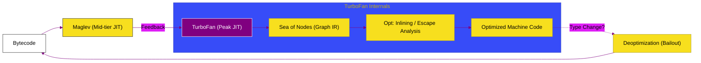

# BK-02: Advanced Optimizations (TurboFan & Maglev)

> **"Puncak Performa: Bagaimana V8 Menggunakan Analisis Spekulatif dan JIT Compiler Tingkat Tinggi untuk Mencapai Kecepatan Kode Native."**

---

## 🌓 1. Essence: The Narrative

### Dual Definition
- **Formal**: Arsitektur optimasi V8 yang melibatkan **Maglev** (Mid-tier JIT) untuk kompilasi cepat yang cukup optimal, dan **TurboFan** (Peak JIT) untuk optimasi kustom tingkat sistem menggunakan representasi grafis **Sea of Nodes**. Berfokus pada eliminasi redundansi dan pemanfaatan tipe data yang stabil.
- **Analogi**: Bayangkan **Menulis Naskah Film (JS Code)**. **Maglev** adalah asisten sutradara yang mengatur bloking dasar secara cepat agar syuting bisa dimulai. **TurboFan** adalah editor film profesional yang duduk di ruang editing selama berjam-jam untuk memotong setiap frame yang tidak perlu, menambahkan efek khusus, dan memastikan hasil akhirnya adalah sebuah *Masterpiece* (Machine Code) yang sangat halus.

---

## 🗺️ 2. Visual Logic: The TurboFan Pipeline

Bagaimana kode yang "panas" dioptimalkan hingga level puncak:

---

## 🏛️ 3. Strategic Chapters (Levels 5)

Optimalisasi mesin V8 modern:

1.  **[CH-01: Maglev (The Mid-tier Link)](./CH-01_Maglev/)**
    *JIT compiler terbaru (2023) yang menyeimbangkan latensi dan throughput.*
2.  **[CH-02: TurboFan & Sea of Nodes](./CH-02_TurboFan/)**
    *Bedah mekanisme Advanced JIT: Inlining, Loop Unrolling, dan Range Analysis.*

---

## 🧠 4. Under-the-hood: The "Speculative" Gamble
Optimasi JIT tingkat tinggi (TurboFan) bersifat **Spekulatif**. Artinya, V8 "bertaruh" bahwa tipe data yang Anda gunakan hari ini (misal: Integer) akan tetap sama besok. TurboFan membangun jalur cepat berdasarkan asumsi ini. Namun, jika asumsi tersebut melesat (misal: Anda mendadak mengirim String ke fungsi yang biasanya menerima Number), V8 akan melakukan **Deoptimization (Bailout)**—membuang machine code yang dioptimalkan dan kembali ke interpreter. Inilah alasan mengapa monomorfisme sangat penting bagi performa JavaScript.

---

## 🎖️ 5. The Gold Standard Checklist
- [x] **Spec-Alignment**: Sinkronisasi dengan V8 TurboFan & Maglev internals.
- [x] **Visual Logic**: Mermaid diagram TurboFan Pipeline (Sea of Nodes).
- [x] **Mental Model**: Analogi "Editor Film & Masterpiece".

---
*Buku Status: [x] Complete | [status.md](../../status.md) | Kembali ke [SR-01](../README.md)*
