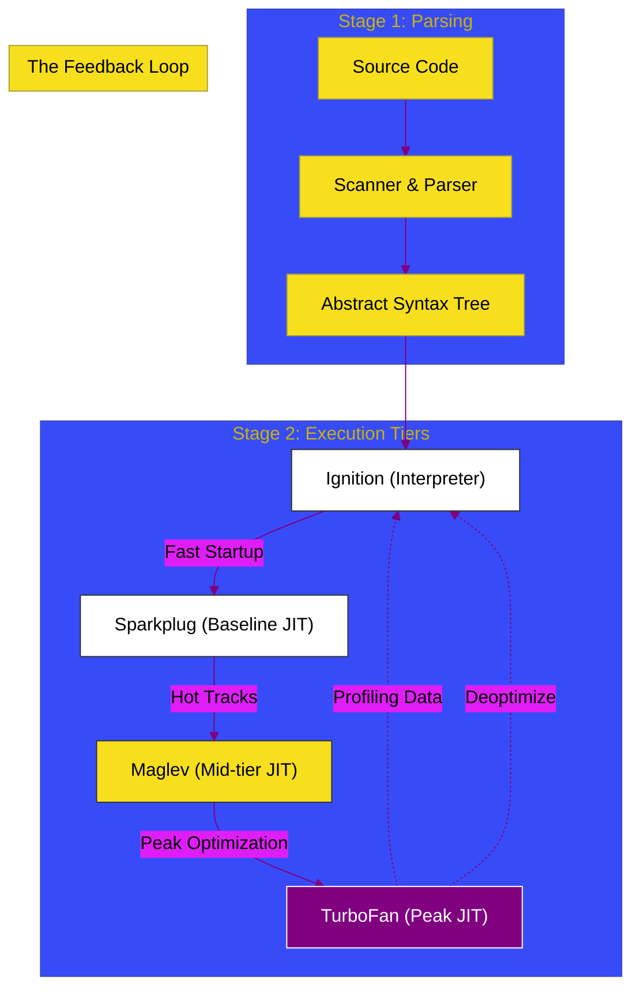

# SR-01: V8 Architecture (The Chrome Titan)

> **"Pusat Komando Eksekusi: Membedah Arsitektur Multi-tier V8 yang Mentransformasi JavaScript dari Bahasa Dinamis Menjadi Performa Native."**

---

## 🌓 1. Essence: The Narrative

### Dual Definition
- **Formal**: Arsitektur internal mesin **V8** (Chrome/Node.js/Deno) yang menggunakan sistem kompilasi bertingkat (**Tiered Compilation**) untuk menyeimbangkan kecepatan startup dan performa jangka panjang. Menggabungkan interpreter bytecode (**Ignition**) dengan berbagai level JIT compiler (**Sparkplug**, **Maglev**, **TurboFan**).
- **Analogi**: Bayangkan sebuah **Pabrik Manufaktur Masa Depan**. Saat pesanan datang (JS Code), pabrik langsung memulai produksi secara manual (**Ignition**) agar pelanggan tidak menunggu. Di saat yang sama, robot perakit dasar mulai bekerja (**Sparkplug**). Jika pesanan terus bertambah, lini produksi otomatis yang lebih canggih diaktifkan (**Maglev**), hingga puncaknya, seluruh pabrik dikendalikan oleh AI super-efisien (**TurboFan**) untuk produksi massal dengan kecepatan cahaya.

---

## 🗺️ 2. Visual Logic: V8 Execution Hierarchy

Hierarki kompilasi dan optimasi V8 modern (Post-2023):

---

## 🏛️ 3. Strategic Books (Levels 4)

Bedah mendalam arsitektur kompilasi:

- **[BK-01: The Multi-tier Pipeline](./BK-01_ThePipeline/)**: Membedah Ignition dan Sparkplug.
- **[BK-02: Advanced Optimizations](./BK-02_TurboFanMaglev/)**: Membedah Maglev dan TurboFan.

---

## 🧠 4. Under-the-hood: The "Tiered" Logic
V8 tidak langsung mengoptimalkan kode Anda. Optimasi memakan waktu dan memori CPU. Itulah mengapa V8 menggunakan strategi bertingkat:
1.  **Ignition** (Interpreter): Memulai eksekusi instan.
2.  **Sparkplug** (Baseline): Kompiler non-optimasi yang sangat cepat.
3.  **Maglev** (Mid-tier): Menambah optimasi dasar tanpa beban berat TurboFan.
4.  **TurboFan** (Peak): Melakukan optimasi matematika dan memori tingkat tinggi (Sea of Nodes).

---

## 🎖️ 5. The Gold Standard Checklist
- [x] **Spec-Alignment**: Sesuai dengan V8 architecture modern (Post-Maglev 2023).
- [x] **Visual Logic**: Mermaid diagram hierarki eksekusi.
- [x] **Mental Model**: Analogi "Pabrik Manufaktur Bertingkat".

---
*Status Dokumen: [x] Full Hardened | [status.md](../../status.md) | Kembali ke [RAK-06](../README.md)*
