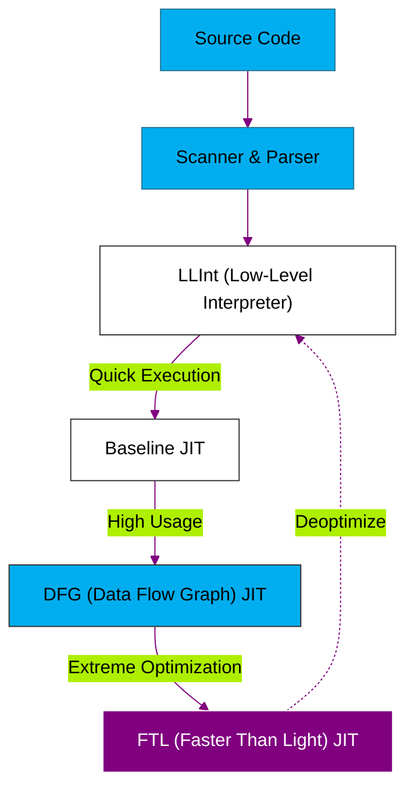

# BK-01: JSC Architecture (The Bun Challenger)

> **"Spesialis Kecepatan: Membedah Jalur Kompilasi Bertingkat (LLInt, DFG, FTL) yang Menentukan Performa Safari dan Runtime Bun."**

---

## 🌓 1. Essence: The Narrative

### Dual Definition
- **Formal**: Arsitektur internal mesin **JavaScriptCore (JSC)** yang menggunakan empat lapis kompilasi (Four-tier Compilation) untuk menyeimbangkan kecepatan startup dan performa puncak. JSC dikenal dengan interpreter bytecode-nya yang sangat cepat (**LLInt**) dan optimasi tingkat tinggi pada lapisan **FTL (Faster Than Light)**.
- **Analogi**: Jika V8 adalah mobil dengan transmisi 4 kecepatan (Ignition-Spark-Maglev-Turbo), maka JSC adalah mobil dengan 4 transmisi yang dioptimisasi secara spesifik (LLInt-Baseline-DFG-FTL). Perbedaannya, gigi pertama JSC (**LLInt**) jauh lebih ringan dan cepat masuk ke jalan raya daripada gigi pertama V8, itulah alasan mengapa **Bun** (yang menggunakan JSC) memiliki kecepatan **Cold Start** yang superior dibandingkan Node.js.

---

## 🗺️ 2. Visual Logic: JSC Multi-tier Pipeline

Struktur kompilasi bertingkat pada JavaScriptCore:

---

## 🏛️ 3. Strategic Chapters (Levels 5)

Bedah arsitektur tiered JSC:

1.  **[CH-01: LLInt (Low-Level Interpreter)](./CH-01_LLInt/)**
    *Interpreter level rendah yang ditulis sepenuhnya dalam assembly.*
2.  **[CH-02: Baseline & DFG JIT](./CH-02_DFG/)**
    *Level optimasi pertama dan pengumpulan data profil eksekusi.*
3.  **[CH-03: FTL (Faster Than Light)](./CH-03_FTL/)**
    *Kompiler tingkat tinggi yang memanfaatkan backend B3 (Bare Bones Backend).*

---

## 🧠 4. Under-the-hood: LLInt vs Ignition
Salah satu rahasia JSC adalah **LLInt** (Low Level Interpreter). Berbeda dengan V8 yang menulis interpreter-nya (Ignition) dalam bytecode yang diinterpretasikan oleh C++, LLInt ditulis dalam bahasa assembly khusus yang langsung berinteraksi dengan hardware. Ini membuat proses eksekusi kode awal di JSC jauh lebih hemat memori dan cepat.

---

## 📜 5. Architect's Principles (PPM V4)

1. **Leverage the Cold Start**: JSC sangat efisien untuk skrip pendek yang sering dijalankan ulang (seperti CLI tools).
2. **Profile-Driven Optimization**: Semakin stabil tipe data Anda, semakin cepat JSC bisa mempromosikan kode Anda dari DFG ke FTL yang menggunakan optimasi matematika berat.
3. **FTL is Power**: Lapisan FTL menggunakan teknik optimasi yang menyerupai kompiler C++ (seperti LLVM di masa lalu), sehingga untuk komputasi berat dan berulang, JSC seringkali bisa menyaingi atau bahkan melampaui V8.

---

## 🎖️ 6. The Gold Standard Checklist
- [x] **Spec-Alignment**: Sinkronisasi dengan arsitektur JSC modern (Post-B3 backend).
- [x] **Visual Logic**: Mermaid diagram Four-tier Pipeline.
- [x] **Mental Model**: Analogi "Gigi Transisi 4-Speed (Superior Gigi Pertama)".

---
*Buku Status: [x] Full Hardened | [status.md](../../status.md) | Kembali ke [SR-02](../README.md)*
