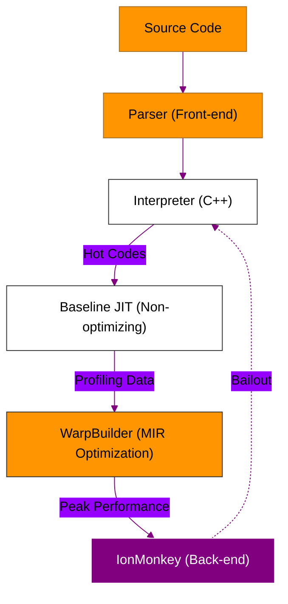

# BK-02: SpiderMonkey Internals (The Firefox Legend)

> **"Legenda Hidup: Memutre Arsitektur SpiderMonkey (Firefox) yang Menjadi Pionir JIT Compilation dan Penggerak Web Modern Pertama."**

---

## 🌓 1. Essence: The Narrative

### Dual Definition
- **Formal**: Mesin JavaScript milik Mozilla yang ditulis dalam C++ dan Rust. Merupakan mesin JS pertama yang pernah dibuat (oleh Brendan Eich pada 1995). SpiderMonkey modern menggunakan sistem JIT bertingkat (Baseline, IonMonkey) dan arsitektur **CacheIR** untuk menangani optimasi tipe data lintas platform secara efisien.
- **Analogi**: Bayangkan **Pesawat Jet Pionir**. SpiderMonkey adalah yang pertama kali terbang (JS murni). Meskipun sekarang banyak pesawat lain (V8, JSC), SpiderMonkey masih terus berevolusi dengan teknologi turbo baru (**IonMonkey**) dan kontrol kabin yang sangat presisi (**CacheIR**). Tanpa inovasi SpiderMonkey dalam JIT, kita mungkin tidak akan memiliki web yang interaktif seperti sekarang.

---

## 🗺️ 2. Visual Logic: SpiderMonkey JIT Pipeline

Struktur jalur eksekusi pada SpiderMonkey modern (Post-WarpBuilder):

---

## 🏛️ 3. Strategic Chapters (Levels 5)

Eksplorasi jantung Firefox:

1.  **[CH-01: Baseline JIT & CacheIR](./CH-01_Baseline/)**
    *Infrastruktur optimasi tipe data yang efisien.*
2.  **[CH-02: IonMonkey (Peak JIT)](./CH-02_Ion/)**
    *Level optimasi mendalam menggunakan MIR (Mid-level Intermediate Representation).*
3.  **[CH-03: WASM Integration](./CH-03_WASM/)**
    *Bagaimana SpiderMonkey memimpin dalam eksekusi WebAssembly.*

---

## 🧠 4. Under-the-hood: The "CacheIR" Innovation
V8 dan JSC memiliki cara mereka sendiri untuk menangani Inline Caching (IC), tetapi SpiderMonkey memperkenalkan **CacheIR**. CacheIR adalah bahasa perantara sederhana yang mendeskripsikan kondisi optimasi (misalnya: "Jika objek ini memiliki properti X"). Kelebihannya adalah CacheIR bisa dengan mudah dikompilasi ke dalam native code oleh berbagai level JIT compiler di SpiderMonkey tanpa perlu menulis ulang logika optimasi berulang kali.

---

## 📜 5. Architect's Principles (PPM V4)

1. **Standard First**: SpiderMonkey cenderung mengutamakan kepatuhan spesifikasi (spec-compliance) yang ketat sebelum mengejar optimasi kotor (dirty hacks).
2. **Rust-Powered**: Beberapa bagian modern SpiderMonkey (seperti parser reguler expression) mulai bermigrasi ke Rust untuk keamanan memori.
3. **Debuggable**: SpiderMonkey menyediakan tooling yang sangat baik untuk memantau deoptimasi dan performa mesin melalui Firefox Developer Tools.

---

## 🎖️ 6. The Gold Standard Checklist
- [x] **Spec-Alignment**: Sinkronisasi dengan arsitektur SpiderMonkey Post-Warp (2020+).
- [x] **Visual Logic**: Mermaid diagram JIT Pipeline (Warp/Ion).
- [x] **Mental Model**: Analogi "Pesawat Jet Pionir".

---
*Buku Status: [x] Complete | [status.md](../../status.md) | Kembali ke [SR-02](../README.md)*
