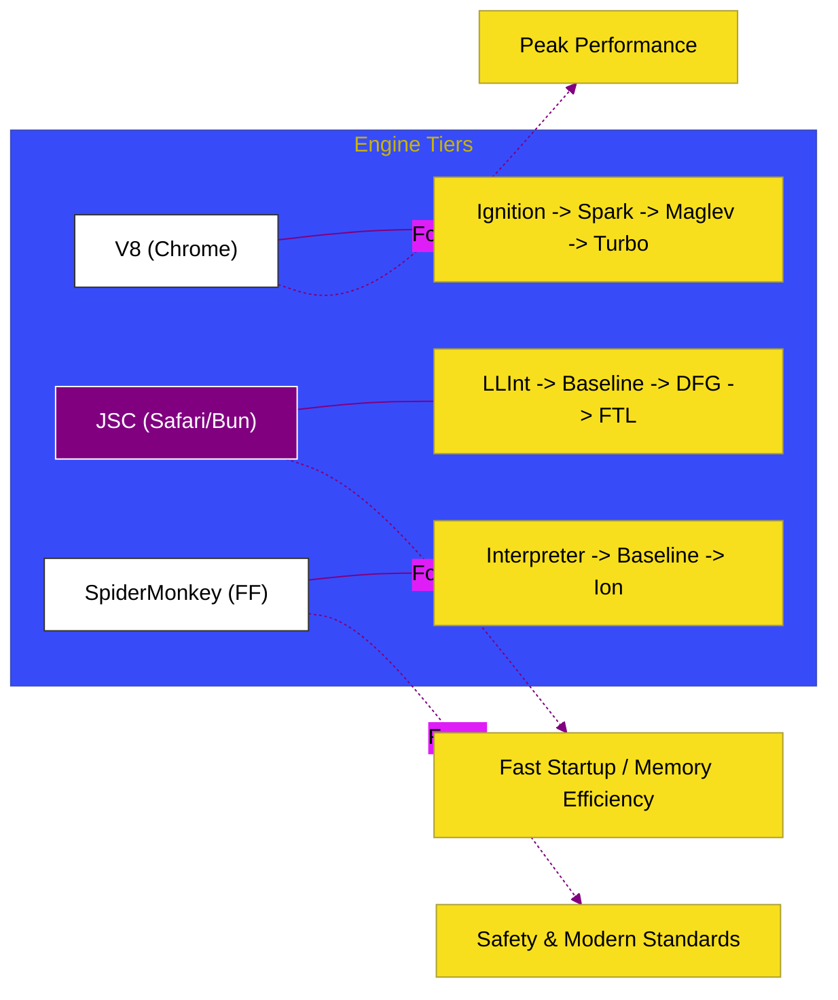

# SR-02: Alternative Engines (JSC & SpiderMonkey)

> **"Kekuatan Alternatif: Membedah Arsitektur JavaScriptCore (Safari/Bun) dan SpiderMonkey (Firefox) yang Menjadi Penantang Utama Dominasi V8."**

---

## 🌓 1. Essence: The Narrative

### Dual Definition
- **Formal**: Hub yang didedikasikan untuk memahami mesin JavaScript di luar ekosistem Chromium. Berfokus pada arsitektur **JavaScriptCore (JSC)** milik WebKit dan **SpiderMonkey** milik Mozilla. Memahami perbedaan filosofi desain (seperti tiering pipeline) sangat krusial untuk mengoptimalkan aplikasi lintas browser dan runtime modern seperti **Bun**.
- **Analogi**: Jika V8 adalah **Mesin Formula 1 (Kecepatan Puncak)**, maka JSC adalah **Mesin Mobil Sport (Cold Start Cepat)** dan SpiderMonkey adalah **Mesin Pesawat Jet Klasik (Inovasi Historis)**. Masing-masing memiliki cara berbeda untuk mengubah bensin (JS Code) menjadi tenaga pendorong, dan memahami perbedaannya membuat Anda menjadi "mekanik" kode yang lebih andal.

---

## 🗺️ 2. Visual Logic: The Engine Matrix

Perbandingan filosofi desain antar Engine:

---

## 🏛️ 3. Strategic Books (Levels 4)

Bedah mendalam penantang V8:

- **[BK-01: JavaScriptCore (JSC)](./BK-01_JSC_Architecture/)**: Arsitektur di balik Safari dan Bun.
- **[BK-02: SpiderMonkey Internals](./BK-02_SpiderMonkey/)**: Jantung eksekusi browser Firefox.

---

## 🧠 4. Under-the-hood: Why Alternative Engines?
Keberadaan engine selain V8 menjaga ekosistem JavaScript tetap sehat melalui kompetisi fitur dan standar. Misalnya, **JSC** sering dianggap lebih unggul dalam "Cold Start" (seberapa cepat mesin mulai berjalan), yang dimanfaatkan oleh **Bun** untuk performa server-side yang instan. Sementara **SpiderMonkey** sering menjadi pionir dalam implementasi fitur-fitur baru dari proposal TC39.

---

## 🎖️ 5. The Gold Standard Checklist
- [x] **Spec-Alignment**: Sinkronisasi dengan WebKit (JSC) dan MDN (SpiderMonkey) architecture.
- [x] **Visual Logic**: Mermaid perbandingan tiered architecture.
- [x] **Mental Model**: Analogi "Mekanik Mesin Berbeda (F1 vs Sport)".

---
*Status Dokumen: [x] Full Hardened | [status.md](../../status.md) | Kembali ke [RAK-06](../README.md)*
