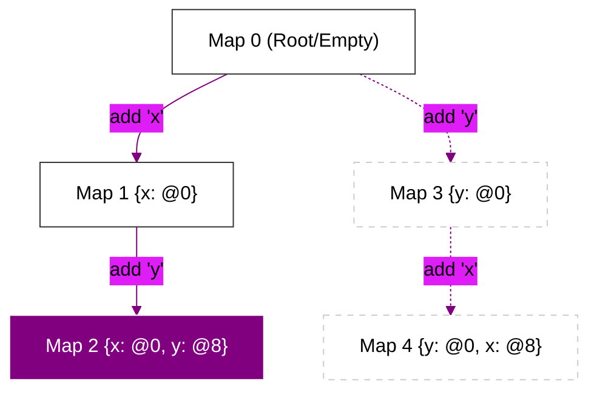

# CH-01: Hidden Classes (Maps)

> **"Genom Objek: Bagaimana V8 Memberikan Struktur Statis pada Objek Dinamis untuk Kecepatan Akses Memori Maksimal."**

---

## 🌓 1. Essence: The Narrative

### Dual Definition
- **Formal**: Struktur data internal yang dibuat oleh V8 untuk melacak skema (properti dan offset memori) dari objek dinamis. Setiap kali properti ditambahkan, V8 melakukan transisi ke Hidden Class baru.
- **Analogi**: Bayangkan **DNA Manusia**. Meskipun kita bisa tumbuh dan berubah (tambah properti), DNA dasar kita (Hidden Class) menentukan struktur biologis kita. Jika dua orang memiliki DNA yang identik (properti yang sama dalam urutan yang sama), mereka bisa masuk ke fasilitas yang sama dengan izin yang sama (Optimized Access).

---

## 🗺️ 2. Visual Logic: The Transition Tree

Mekanisme transisi Maps saat properti ditambahkan:

---

## 🏛️ 3. Under-the-hood: Memory Offsets
Tanpa Hidden Classes, V8 harus melakukan pencarian string (hash table lookup) setiap kali Anda memanggil `obj.x`. Dengan Hidden Classes, V8 menyimpan informasi bahwa properti `x` selalu berada pada **Offset 0** dari alamat memori objek tersebut. Pencarian string digantikan oleh akses memori langsung (Pointer Addition), yang secara radikal meningkatkan performa.

---

## 📜 4. Architect's Rules (PPM V4)

1. **Inisialisasi di Constructor**: Selalu inisialisasi semua properti di dalam constructor untuk meminimalkan transisi Maps yang berulang.
2. **Jaga Konsistensi Urutan**: `new Point(1, 2)` dan `new Point(2, 1)` harus memulai dengan urutan properti yang sama agar berbagi Map yang sama.
3. **Hindari 'Delete'**: Menghapus properti akan memutus rantai transisi dan memaksa objek masuk ke **Dictionary Mode** (Hash Table).

---

## 🎖️ 5. The Gold Standard Checklist
- [x] **Spec-Alignment**: Sinkronisasi dengan V8 Shape/Map specifications.
- [x] **Visual Logic**: Mermaid Transition Tree (Multi-branch).
- [x] **Mental Model**: Analogi "DNA Manusia".

---
*Status Bab: [x] Full Hardened | [status.md](../../status.md) | Kembali ke [BK-01](../README.md)*
