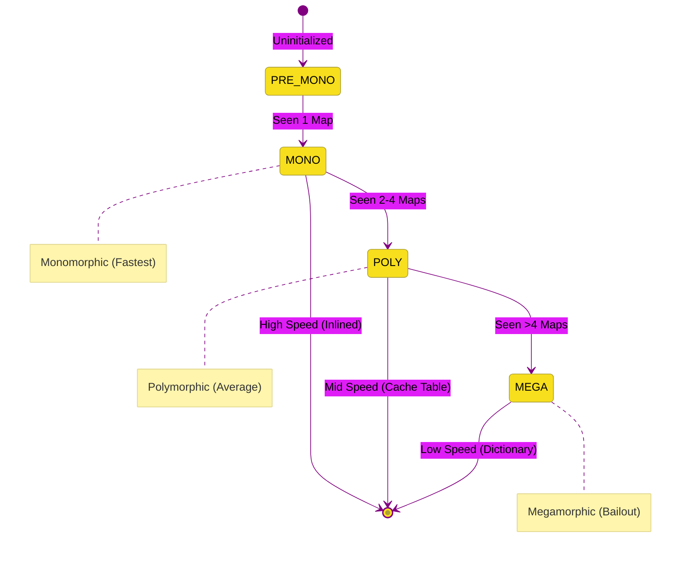

# CH-02: Inline Caches (ICs)

> **"Speed Dial Properti: Bagaimana V8 Mengingat Lokasi Memori Properti untuk Menghindari Pencarian yang Berulang-ulang."**

---

## 🌓 1. Essence: The Narrative

### Dual Definition
- **Formal**: Mekanisme optimasi di level bytecode dan JIT yang menyimpan hasil pencarian properti (offset memori) secara lokal pada titik pemanggilan fungsi. IC menggunakan data historis untuk memprediksi lokasi properti di masa depan.
- **Analogi**: Bayangkan **Speed Dial pada Telepon**. Tanpa IC (Telpon Manual), Anda harus mencari nomor teman di buku telepon raksasa (Hidden Class Table) setiap kali ingin menelpon. Dengan **IC (Speed Dial)**, Anda menyimpan nomor tersebut di tombol "1". Saat ingin menelpon lagi, Anda cukup menekan satu tombol tanpa perlu mencari lagi. Namun, jika teman Anda ganti nomor (Change Shape), Anda harus memperbarui Speed Dial tersebut.

---

## 🗺️ 2. Visual Logic: IC State Machine

V8 mengklasifikasikan efisiensi cache berdasarkan variasi objek yang "lewat" melalui fungsi:

---

## 🏛️ 3. Under-the-hood: The Feedback Vector
Setiap fungsi di V8 memiliki **Feedback Vector**—sebuah array data yang menyimpan statistik eksekusi. Di dalam array ini terdapat **Slots** khusus untuk setiap operasi akses properti.
- **Slot Status**: Menyimpan kaitan antara **Map ID** dan **Memory Offset**.
- **The Gamble**: Saat Ignition menemui operasi `obj.x`, ia akan melihat Slot IC. Jika Map objek saat ini cocok dengan Map yang tersimpan di Slot, Ignition langsung mengambil nilai di offset tersebut. Inilah mengapa JavaScript bisa secepat bahasa statis.

---

## 📜 4. Architect's Principles (PPM V4)

1. **Monomorphism is King**: Usahakan sebuah fungsi selalu menerima objek dengan "Shape" yang identik. Ini memungkinkan TurboFan melakukan **Inlining** (menghapus overhead fungsi sama sekali).
2. **Beware of Variadic Shapes**: Mengirimkan objek dengan urutan properti berbeda atau tipe data properti yang berbeda ke satu fungsi yang sama akan memicu status **Polymorphic** atau **Megamorphic**.
3. **Stability**: Semakin stabil input Anda, semakin tajam optimasi yang bisa dilakukan oleh mesin JIT.

---

## 🎖️ 5. The Gold Standard Checklist
- [x] **Spec-Alignment**: Sinkronisasi dengan V8 IC & Feedback Vector specs.
- [x] **Visual Logic**: Mermaid IC State Machine diagram.
- [x] **Mental Model**: Analogi "Speed Dial Telepon".

---
*Status Bab: [x] Full Hardened | [status.md](../../status.md) | Kembali ke [BK-01](../README.md)*
