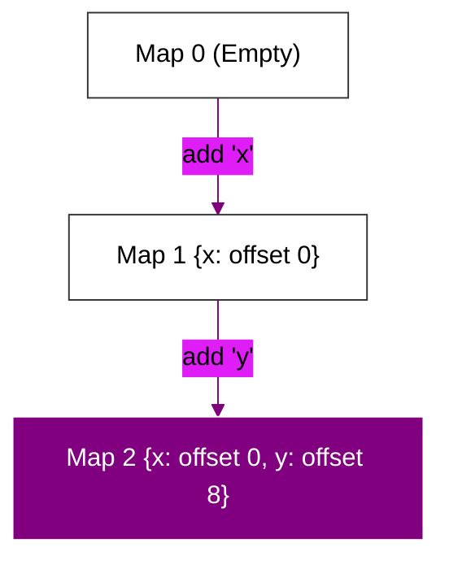

# BK-01: Object Mechanics (Maps & IC)

> **"Rahasia Kecepatan Objek: Bagaimana Mesin JavaScript Mengubah Objek Dinamis Menjadi Struktur Statis Melalui Hidden Classes (Maps) dan Inline Caching (IC)."**

---

## 🌓 1. Essence: The Narrative

### Dual Definition
- **Formal**: Mekanisme optimasi obyek di V8 yang menggunakan **Hidden Classes (Maps)** untuk memberikan identitas skema pada objek dinamis, dan **Inline Caching (IC)** untuk mengingat lokasi offset properti di memori guna menghindari pencarian yang berulang.
- **Analogi**: Bayangkan **Toko Serba Ada (Dynamic Object)**. Tanpa sistem (JS murni), setiap kali pelanggan mencari "Garam", penjaga harus keliling seluruh toko. Dengan **Maps (Hidden Classes)**, toko memiliki "Denah Rak" yang tetap. Dengan **Inline Caching (IC)**, penjaga toko langsung hafal bahwa "Garam selalu di Rak 3", sehingga ia bisa mengambilnya dengan mata tertutup (High Speed Access).

---

## 🗺️ 2. Visual Logic: Hidden Class Transition Tree

Bagaimana penambahan properti memicu pembuatan "Skema" baru di RAM:

---

## 🏛️ 3. Strategic Chapters (Levels 5)

Eksesibilitas dan mekanika objek:

1.  **[CH-01: Hidden Classes (Maps)](./CH-01_HiddenClasses/)**
    *Bedah mekanisme skema objek dan transisi Maps.*
2.  **[CH-02: Inline Caching (IC)](./CH-02_InlineCaches/)**
    *Mendeteksi monomorfisme, polimorfisme, dan megamorfisme.*
3.  **[CH-03: Deoptimization Rules](./CH-03_Deoptimization/)**
    *Aturan main agar V8 tidak melakukan 'bailout' saat memproses objek.*

---

## 🧠 4. Under-the-hood: Why Monomorphism?
Inline Caching bekerja maksimal pada fungsi yang bersifat **Monomorphic** (hanya menerima satu jenis Map objek). Jika fungsi menerima objek dengan Map berbeda (Polymorphic), V8 harus mengecek tabel Maps, yang memperlambat akses. Inilah mengapa praktis terbaik adalah menjaga skema objek (order of property initialization) tetap konsisten.

---

## 🎖️ 5. The Gold Standard Checklist
- [x] **Spec-Alignment**: Sinkronisasi dengan V8 Hidden Class & IC specs.
- [x] **Visual Logic**: Mermaid Transition Tree.
- [x] **Mental Model**: Analogi "Toko Serba Ada & Denah Rak".

---
*Buku Status: [x] Complete | [status.md](../../status.md) | Kembali ke [SR-03](../README.md)*
