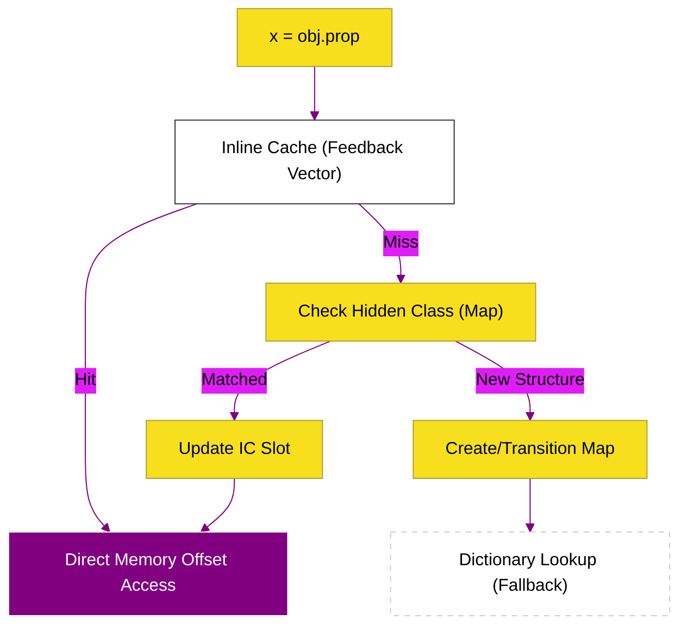

# SR-03: Object Efficiency (The Speed Weaver)

> **"Penenun Kecepatan: Membedah Mekanisme V8 dalam Menstandarisasi Objek Dinamis Menjadi Struktur RAM yang Solid dan Cepat."**

---

## 🌓 1. Essence: The Narrative

### Dual Definition
- **Formal**: Hub optimasi yang berfokus pada **Object Representation** di tingkat memori. Menggunakan **Hidden Classes (Maps)** untuk skema objek dan **Inline Caching (IC)** untuk optimasi lookup properti. Hub ini adalah alasan mengapa JavaScript modern bisa menyaingi performa bahasa kompilasi statis.
- **Analogi**: Bayangkan **Perpustakaan Digital**. Jika setiap buku (Object) diletakkan sembarangan (Dynamic Access), pustakawan butuh waktu lama untuk mencarinya. **Maps (Hidden Classes)** memberikan nomor panggil dan lokasi rak yang tetap untuk setiap kategori buku. **Inline Caching (IC)** adalah sistem memori pustakawan yang langsung ingat lokasi buku terpopuler tanpa perlu mengecek katalog lagi.

---

## 2. Visual Logic: Memory Access Optimization

Alur optimasi akses objek dari pemanggilan hingga RAM:

---

## 🏛️ 3. Strategic Books (Levels 4)

Pilar efisiensi objek:

- **[BK-01: Object Mechanics (Maps & IC)](./BK-01_ObjectMechanics/)**: Bedah mendalam Hidden Classes dan Inline Caching.

---

## 🧠 4. Under-the-hood: The "Shape" Logic
V8 tidak pernah melihat objek sebagai "tas properti" (property bag) acak. V8 selalu berusaha memberikan **Shape** (Bentuk). Jika dua objek memiliki properti yang sama dalam urutan yang sama, mereka berbagi Shape yang sama. Ini memungkinkan mesin JIT melakukan **Speculative Inlining**—menanamkan kode akses memori langsung ke dalam fungsi yang dioptimalkan.

---

## 🎖️ 5. The Gold Standard Checklist
- [x] **Spec-Alignment**: Sinkronisasi dengan V8 Object Representation (Maps/ICs).
- [x] **Visual Logic**: Mermaid diagram optimasi akses memori.
- [x] **Mental Model**: Analogi "Perpustakaan Digital & Nomor Panggil".

---
*Status Dokumen: [x] Full Hardened | [status.md](../../status.md) | Kembali ke [RAK-06](../README.md)*
