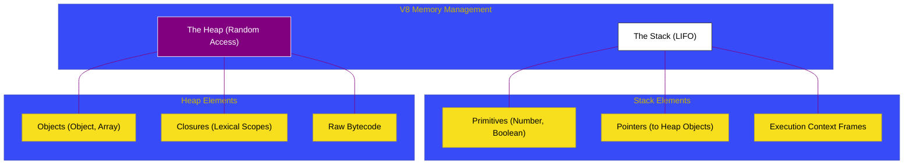

# CH-01: Memory Layouts (Stack vs Heap)

> **"Arsitektur Penyimpanan: Memahami Perbedaan Fisik Antara Stack dan Heap di Dalam Mesin JavaScript."**

---

## 🌓 1. Essence: The Narrative

### Dual Definition
- **Formal**: Struktur organisasi memori di V8 di mana **Stack** digunakan untuk penyimpanan data primitif dan execution context frames yang bersifat LIFO (Last-In-First-Out), sementara **Heap** digunakan untuk penyimpanan objek dinamis berukuran besar yang membutuhkan manajemen memori yang lebih kompleks (GC).
- **Analogi**: Bayangkan **Meja Kerja (Stack)** dan **Gudang (Heap)**. Meja kerja Anda terbatas (Stack) namun sangat cepat diakses; Anda meletakkan pulpen, kertas, dan kalkulator (Primitif) di sana. Gudang (Heap) sangat luas namun butuh waktu untuk mengambil barang; Anda menyimpan kotak-kotak besar (Objects) di sana dan memberikan catatan (Pointer) di meja kerja Anda tentang lokasi kotak tersebut di gudang.

---

## 🗺️ 2. Visual Logic: Memory Segment Partitioning

Pembagian tugas antara Stack dan Heap:

---

## 🏛️ 3. Under-the-hood: Stack Allocation vs Heap Fragmentation
Alokasi pada **Stack** bersifat instan (hanya menggerakkan pointer stack). Namun, **Heap** jauh lebih rumit karena alokasi terjadi secara acak, yang menyebabkan Fragmentasi seiring waktu. Itulah sebabnya V8 membutuhkan Garbage Collector untuk melakukan **Compaction** (merapikan memori) agar tidak ada celah kosong yang terbuang sia-sia di antara objek-objek.

---

## 📜 4. Architect's Principles (PPM V4)

1. **Stack for Speed**: Gunakan variabel lokal dan primitif sesering mungkin untuk memanfaatkan kecepatan alokasi stack.
2. **References are Heavy**: Ingatlah bahwa setiap objek besar di Heap hanya direpresentasikan oleh sebuah pointer (8 byte) pada stack. Menghapus referensi pada stack adalah kunci agar GC bisa membersihkan heap.
3. **Avoid Large Heap Allocation in Loops**: Alokasi objek di dalam loop yang intensif akan memaksa GC bekerja lebih keras (GC Thrashing).

---

## 🎖️ 5. The Gold Standard Checklist
- [x] **Spec-Alignment**: Sinkronisasi dengan V8 Core Memory structures.
- [x] **Visual Logic**: Mermaid diagram partisi memori.
- [x] **Mental Model**: Analogi "Meja Kerja & Gudang".

---
*Status Bab: [x] Full Hardened | [status.md](../../status.md) | Kembali ke [BK-01](../README.md)*
