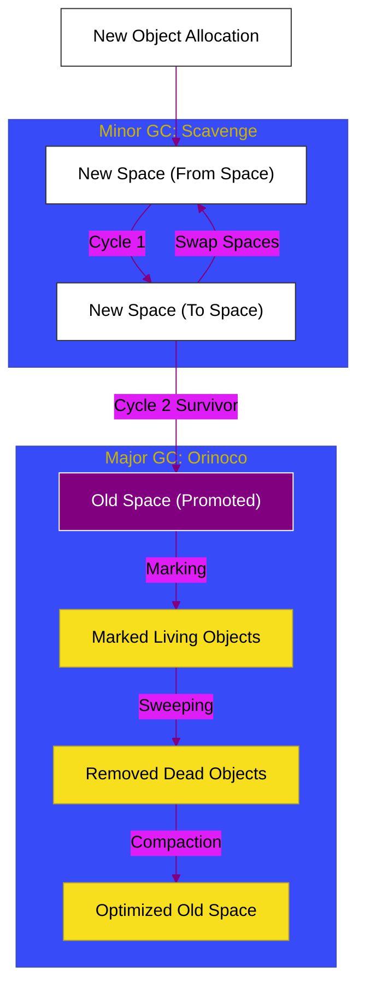

# CH-02: Generational Garbage Collection

> **"Permainan Bertahan Hidup: Bagaimana V8 Memilih Objek yang Layak Hidup dan Membuang Sampah Memori Tanpa Mengganggu Performa Aplikasi."**

---

## 🌓 1. Essence: The Narrative

### Dual Definition
- **Formal**: Strategi manajemen memori otomatis di V8 yang membagi objek ke dalam dua generasi (**Young Gen** dan **Old Gen**) untuk mengoptimalkan frekuensi dan durasi jeda pembersihan (*Stop-the-world pauses*). Menggunakan algoritma **Scavenger** untuk objek baru dan **Mark-Sweep-Compact** untuk objek lama.
- **Analogi**: Bayangkan sebuah **Saringan Bertingkat (Generational GC)**. Objek baru adalah "pasir halus" (Young Gen) yang sering disaring dengan cepat menggunakan saringan atas (**Minor GC**). Objek yang terlalu besar atau yang bertahan lama akan turun ke lapisan bawah sebagai "batu bara" (**Old Gen**). Lapisan bawah ini hanya dibersihkan sesekali dengan saringan yang lebih kuat (**Major GC**) karena prosesnya jauh lebih berat.

---

## 🗺️ 2. Visual Logic: The GC Lifecycle

Alur aliran objek antara New Space dan Old Space:

---

## 🏛️ 3. Under-the-hood: Minor vs Major GC
1. **Minor GC (Scavenger)**: Menggunakan algoritma **Cheney**. Membagi New Space menjadi dua semi-space. Ia hanya memindahkan objek yang hidup ke space sebelah dan membuang seluruh space lama sekaligus. Sangat cepat (1-10ms).
2. **Major GC (Mark-Sweep-Compact)**: Bekerja pada seluruh Heap. Ia menandai objek yang bisa dijangkau dari *root*, menghapus yang tidak terjangkau, dan merapatkan memori agar tidak terfragmentasi.

---

## 🧠 4. Orinoco: The Modern Engine
V8 modern menggunakan proyek **Orinoco** untuk meminimalkan jeda eksekusi:
- **Parallel**: Beberapa thread pembantu melakukan GC secara bersamaan.
- **Incremental**: GC dilakukan sedikit demi sedikit di antara eksekusi JavaScript (agar tidak ada jeda panjang).
- **Concurrent**: Thread pembantu melakukan GC saat thread utama sedang menjalankan JavaScript.

---

## 📜 5. Architect's Principles (PPM V4)

1. **Short-lived objects are free**: Jangan takut membuat objek kecil sementara, karena Scavenger sangat efisien dalam membersihkannya.
2. **Avoid "Leaky" Old Gen**: Objek yang dipromosikan ke Old Space jauh lebih mahal untuk dibersihkan. Hindari menyimpan objek besar di global scope jika tidak diperlukan.
3. **Consolidate Large Allocations**: Objek yang sangat besar langsung masuk ke **Large Object Space** dan melewati New Space sama sekali, membebani Major GC.

---

## 🎖️ 6. The Gold Standard Checklist
- [x] **Spec-Alignment**: Sinkronisasi dengan V8 Cheney & Mark-Compact specs.
- [x] **Visual Logic**: Mermaid GC Lifecycle diagram.
- [x] **Mental Model**: Analogi "Saringan Bertingkat".

---
*Status Bab: [x] Full Hardened | [status.md](../../status.md) | Kembali ke [BK-01](../README.md)*
