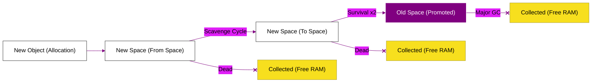

# BK-01: The Memory Web (Generational Heap Logic)

> **"Jaring Memori: Bagaimana Objek Lahir, Bertahan Hidup, dan Dipromosikan di Dalam Arsitektur Heap V8."**

---

## 🌓 1. Essence: The Narrative

### Dual Definition
- **Formal**: Representasi logis dari manajemen memori V8 yang membagi objek berdasarkan usia pemakaiannya. Pemanfaatan strategi **Generational Collection** memastikan bahwa pembersihan memori objek jangka pendek (short-lived) dilakukan secara instan, sementara objek jangka panjang tetap stabil di area yang jarang disentuh GC.
- **Analogi**: Bayangkan **Proses Seleksi Alam (The Memory Web)**. Setiap objek yang dibuat adalah "spesies" baru di ekosistem **New Space**. Mereka harus melewati badai pembersihan (**Scavenger GC**). Jika mereka cukup kuat untuk bertahan hidup lama, mereka akan "bermutasi" dan pindah ke habitat yang lebih permanen (**Old Space**) di mana mereka bisa hidup berdampingan dengan objek inti aplikasi.

---

## 🗺️ 2. Visual Logic: Object Promotion Pipeline

Siklus hidup objek dari alokasi hingga promosi:

---

## 🏛️ 3. Strategic Chapters (Levels 5)

Eksplorasi jaring memori:

1.  **[CH-01: Memory Layouts (Stack vs Heap)](./CH-01_MemoryLayouts/)**
    *Bedah perbedaan alokasi primitif di Stack dan objek di Heap.*
2.  **[CH-02: Generational Garbage Collection](./CH-02_GenerationalGC/)**
    *Mekanisme Scavenger dan Mark-Sweep-Compact.*
3.  **[CH-03: Memory Tools & Profiling](./CH-03_MemoryTools/)**
    *Memburu Memory Leaks menggunakan Chrome DevTools Memory Tab.*

---

## 🧠 4. Under-the-hood: The "Write Barrier"
Saat objek di **Old Space** menunjuk (refer) ke objek di **New Space**, V8 harus mencatatnya secara khusus agar saat pembersihan New Space, objek tersebut tidak sengaja dihapus. Mekanisme pencatatan ini disebut **Write Barrier**. Ini adalah salah satu overhead kecil yang harus dibayar demi kecepatan GC yang bersifat incremental.

---

## 🎖️ 5. The Gold Standard Checklist
- [x] **Spec-Alignment**: Sinkronisasi dengan V8 Memory Layout & Promotion specs.
- [x] **Visual Logic**: Mermaid Promotion Pipeline diagram.
- [x] **Mental Model**: Analogi "Seleksi Alam & Mutasi Habitat".

---
*Buku Status: [x] Complete | [status.md](../../status.md) | Kembali ke [SR-04](../README.md)*
