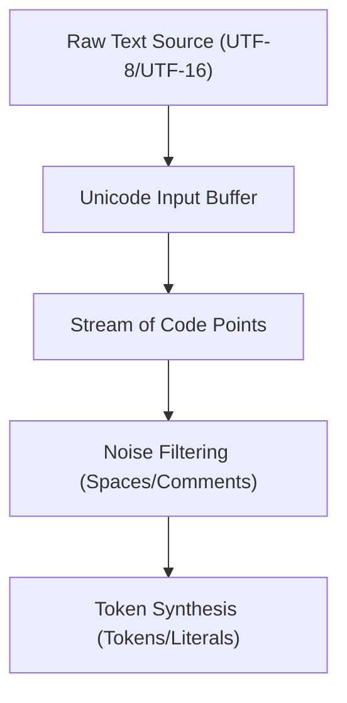

# CH-01: Source Text & Unicode (The Signal Intake)

> **"Sebelum Hub bisa memahami logika, ia harus bisa membaca sinyal mentah. `Source Text` adalah 'Pintu Masuk Sinyal' (The Signal Intake) — sistem yang mengubah aliran teks mentah (Unicode Code Points) menjadi unit energi yang siap diproses."**

*Pemetaan ECMA-262: Clause 11.1 (Source Text)*

## 🏗️ Lexical Scan Flow



## 1. Mental Model: "The Signal Intake"

Bayangkan Hub menerima kabel data raksasa dari luar Grid. 
- **Source Text**: Benang mentah yang Anda tulis. Sebelum ditenun menjadi program, Hub memastikan tidak ada serat terlarang.
- **Unicode**: Standar alfabet universal yang memastikan Hub bisa membaca benang dari mana saja di dunia.
- **Processing**: Hub tidak langsung membaca kata. Ia memecahnya menjadi angka-angka Unicode (Code Points).

---

## 2. Bagaimana Hub Membaca Sinyal?

JavaScript menggunakan skema **UTF-16** untuk merepresentasikan teks (internal string). Namun, pada tahap *Source Text*, spesifikasi menuntut agar file dibaca sebagai deretan **Unicode Code Points** yang valid.

### Komponen Intake:
1. **White Space**: Karakter seperti Spasi atau Tab yang biasanya diabaikan.
2. **Line Terminators**: Karakter pemindah baris (LF, CR) yang penting bagi algoritma ASI.
3. **Comments**: Penjelasan manusia yang dibuang sebelum eksekusi.

---

## 3. Praktik Lapangan (Lab)

```javascript
/* Menggunakan Unicode Code Points & Emoticons */
const signal = "\u{1F680} Launching..."; 
console.log(signal); // 🚀 Launching...

/* Identifier dengan karakter internasional */
const jalurUtama = "ACTIVE"; 
console.log(jalurUtama);
```

---

## Arsitek Mindset: Integritas Sinyal

Sebagai arsitek Hub:
- Pastikan file sumber disimpan dalam format **UTF-8** untuk menghindari distorsi sinyal.
- Sadarilah bahwa `.length` dihitung berdasarkan *Code Units* (16-bit). Untuk sinyal kompleks (emoji), gunakan iterator `[...str]` agar Hub menghitung unit energi (Code Points) yang sebenarnya.

---
*Kembali ke [BK-01](../README.md)*
