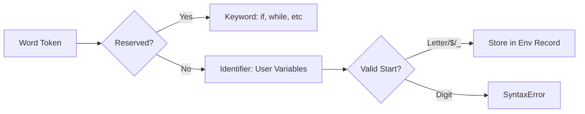

# CH-01: Identifiers & Reserved Words (The Hub Vocabulary)

> **"Setiap mesin dan variabel di Hub harus memiliki nama yang unik. `Identifiers` adalah 'Nama Unit' (Unit Names) — label identitas yang memungkinkan kita untuk memanggil dan mengontrol komponen tertentu di dalam Grid."**

*Pemetaan ECMA-262: Clause 11.6 (Names and Keywords)*

## 1. Mental Model: "The Hub Vocabulary"

- **Identifiers**: Nama yang Anda buat sendiri. Harus dimulai dengan huruf, `$`, atau `_`. Unicode diizinkan (seperti `\u{...}`).
- **Reserved Words**: Nama yang sudah "dipesan" oleh Hub untuk fungsi sistem internal (seperti `if`, `while`, `class`). Anda tidak boleh menggunakan nama ini untuk unit kustom Anda.

## 🏗️ Token Classification



## 2. Aturan Penamaan (The Lexical Rules)

Penyaring Hub (Scanner) memastikan nama unit valid dengan aturan:
1.  **Start Unit**: Karakter pertama harus aman (bukan angka).
2.  **Body Units**: Karakter berikutnya boleh berisi angka.
3.  **No Keywords**: Tidak boleh menabrak 30+ kata kunci sistem yang sudah dipesan.

---

## 3. Praktik Lapangan (Lab)

```javascript
const _sector_A = "ACTIVE"; // Valid
const $power = 500;         // Valid
const π = 3.14;             // Valid (Unicode!)

// const 1stUnit = "ERR";   // ERROR: Tidak boleh dimulai dengan angka
// const class = "ERR";      // ERROR: 'class' adalah Reserved Word
```

---

## Arsitek Mindset: Kejelasan Identitas

Sebagai arsitek Hub:
- Gunakan nama yang deskriptif. Sebuah unit bernama `mainReactorStatus` jauh lebih berharga daripada unit yang hanya bernama `x`.
- Hindari penggunaan Reserved Words sebagai nama properti obyek jika ingin kode Anda kompatibel dengan mesin Hub versi sangat lama (ES3), meskipun di Hub modern hal ini sudah diperbolehkan.

---
*Status: [status.md](../../../docs/status.md)*
