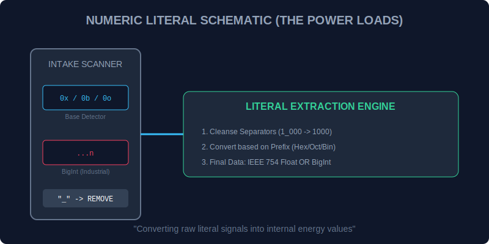

# CH-01: Numeric Literals (The Energy Loads)

> **"Nilai numerik adalah beban energi yang sebenarnya di dalam Hub. `Numeric Literals` adalah 'Tangki Beban' (The Energy Loads) — sekumpulan aturan yang memungkinkan teknisi untuk mendefinisikan berbagai skala daya, dari satuan bit hingga beban industri besar (BigInt)."**

*Pemetaan ECMA-262: Clause 11.8.3 (Numeric Literals)*

## 1. Mental Model: "The Energy Loads"

JavaScript memungkinkan kita memuat energi dalam berbagai format basis:
- **Decimal**: Skala standar kita sehari-hari.
- **Binary (`0b...`)**: Arus listrik tingkat rendah (Bitwise).
- **Octal (`0o...`) & Hex (`0x...`)**: Pengelompokan sinyal yang lebih padat.
- **BigInt (`...n`)**: Beban industri yang melampaui kapasitas tangki standar.

---

## 2. Fitur Keamanan: Numeric Separators

Untuk mencegah kesalahan pembacaan pada tangki beban besar, Hub mendukung tanda pemisah visual (`_`).
`const load = 1_000_000n;` -> Mempermudah teknisi membaca bahwa ini adalah satu juta unit energi. Hub secara otomatis membuang tanda `_` saat proses ekstraksi sinyal.



---

## 3. Praktik Lapangan (Lab)

```javascript
// Berbagai Basis Daya
const bin = 0b1010; // 10
const hex = 0xFF;   // 255
const bigLoad = 10_000_000_000_000n; // BigInt (Industrial)

console.log(`Skala Biner: ${bin}`);
console.log(`Beban Industri: ${bigLoad}`);
```

---

## Arsitek Mindset: Skalabilitas Beban

Sebagai arsitek Hub:
- Gunakan `BigInt` hanya saat Anda berurusan dengan angka yang lebih besar dari $2^{53}-1$. Mencampur beban `Number` dan `BigInt` memerlukan konversi manual (transmutasi) agar tidak terjadi malfungsi sistem.
- Selalu gunakan Numeric Separators untuk nilai-nilai konstanta yang besar agar blueprint kode Anda tetap human-readable.

---
*Status: [status.md](../../../docs/status.md)*
