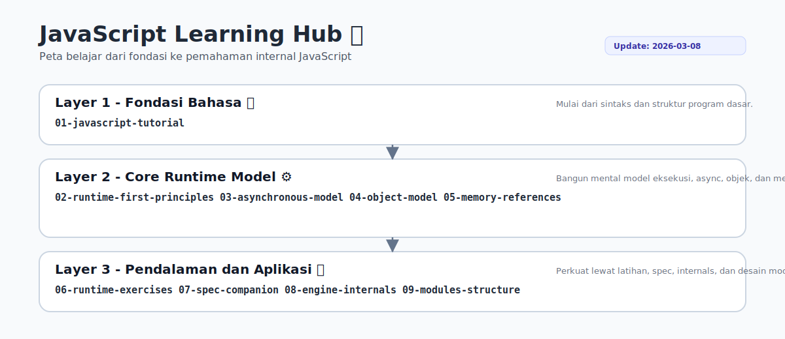

# JavaScript

Repository ini adalah **perpustakaan kecil** yang berisi kumpulan buku teknis tentang JavaScript.

Repository ini **bukan tutorial tunggal** dan bukan juga sebuah handbook besar.  
Sebaliknya, repository ini disusun sebagai **rak buku**, di mana setiap buku membahas satu aspek penting dari bahasa JavaScript.

Tujuan dari repository ini adalah membangun **pemahaman yang kuat dan benar tentang bagaimana JavaScript bekerja**, mulai dari sintaks dasar hingga perilaku runtime dan cara kerja JavaScript engine.

---

# Konsep Repository

Banyak materi JavaScript yang tersedia di internet berfokus pada **cara menggunakan API atau framework**.

Namun sering kali penjelasan tersebut tidak menjelaskan **mengapa JavaScript berperilaku seperti itu**.

Untuk memahami JavaScript secara mendalam, kita perlu memahami:

- bagaimana kode JavaScript dieksekusi
- bagaimana **Execution Context** bekerja
- bagaimana **Lexical Environment** terbentuk
- bagaimana **Event Loop** menjalankan asynchronous code
- bagaimana **Prototype Chain** membentuk object system
- bagaimana nilai dan reference disimpan di memory
- bagaimana JavaScript engine mengeksekusi program

Karena itu repository ini disusun sebagai **kumpulan buku**, sehingga setiap topik dapat dipelajari secara lebih fokus.

---

## Peta Belajar



# Struktur Rak Buku

Repository ini disusun seperti **rak buku teknis**.

Setiap folder merepresentasikan **satu buku**:

```text
JavaScript
|-- 01-javascript-tutorial
|-- 02-javascript-runtime-first-principles
|-- 03-asynchronous-javascript-model
|-- 04-javascript-object-model
|-- 05-javascript-memory-and-references
|-- 06-javascript-runtime-exercises
|-- 07-javascript-specification-companion
|-- 08-javascript-engine-internals
`-- 09-javascript-modules-and-program-structure
```

Setiap buku membahas **satu domain JavaScript** secara khusus.

Jika dipelajari bersama, buku-buku ini akan membentuk **mental model yang utuh tentang JavaScript**.

---

# Daftar Buku

## Status per Buku (Sinkron per 8 Maret 2026)

- 01 - JavaScript Tutorial (`v1.0.0`, 2026-03-07): fondasi sintaks dan pemrograman dasar (11 bab), termasuk variables, data types, operators, conditionals, loops, functions, arrays, objects, modules, dan error handling.
- 02 - JavaScript Runtime First Principles (`v0.3.0`, 2026-03-07): 11 topik runtime dari values/coercion sampai lexical environment, scope chain, execution context lifecycle, call stack, dan memory model high-level.
- 03 - Asynchronous JavaScript Model (`v0.5.0`, 2026-03-07): 10 topik async end-to-end, termasuk concurrency patterns, cancellation/timeout/retry, async iteration, bounded concurrency, dan observability/debugging strategy.
- 04 - JavaScript Object Model (`v0.3.1`, 2026-03-06): 12 topik object system dari prototype fundamentals sampai Proxy/Reflect, internal methods (`[[Get]]`, `[[Set]]`, `[[DefineOwnProperty]]`), serta method dispatch dan object context.
- 05 - JavaScript Memory and References (`v0.3.0`, 2026-03-08): 12 topik memory/reference dari lifecycle dasar sampai WeakRef/FinalizationRegistry, circular references/serialization traps, memory profiling, dan pengantar SharedArrayBuffer/Atomics.
- 06 - JavaScript Runtime Exercises (`v0.3.4`, 2026-03-06): 8 paket drill runtime bertingkat + answer keys terpisah, mencakup closure, `this`, async order, mutation/reference sharing, promise error flow, event loop starvation, prototype/class, dan debugging integratif.
- 07 - JavaScript Specification Companion (`v0.3.1`, 2026-03-08): 8 topik guided reading ECMAScript spec dengan quality pass editorial untuk workflow baca, mini mapping, checkpoint, dan jebakan umum.
- 08 - JavaScript Engine Internals (`v0.3.1`, 2026-03-08): 8 topik engine dengan quality pass end-to-end (parse -> AST -> bytecode, interpreter vs JIT tiering, deopt triggers, GC mental model, profiling, case study investigasi).
- 09 - JavaScript Modules and Program Structure (`v0.3.1`, 2026-03-08): 8 topik modul + penyelarasan dokumentasi belajar (index operasional, prasyarat teknis, kamus istilah) untuk linking/evaluation order, circular dependencies, dan boundary design.

---

## Ringkasan per Buku

## 01 - JavaScript Tutorial

Fokus: **penggunaan bahasa JavaScript dari nol** melalui 11 bab terstruktur.

Topik utama:

- program pertama
- variables
- data types
- operators
- conditionals
- loops
- functions
- arrays
- objects
- modules
- error handling

Tujuan buku ini adalah memahami **bagaimana menulis program JavaScript**.

---

## 02 - JavaScript Runtime First Principles

Fokus: **mental model runtime JavaScript** pada level sebab-akibat eksekusi kode.

Topik utama:

- Values, Types, dan Coercion
- Execution Context
- Lexical Environment
- Scope dan Scope Chain
- Hoisting
- Closures
- `this` binding
- Call Stack
- Memory model (high-level)

Tujuan buku ini adalah membangun **mental model tentang bagaimana kode JavaScript dieksekusi**.

---

## 03 - Asynchronous JavaScript Model

Fokus: **prediksi urutan eksekusi asynchronous code** secara deterministik.

Topik utama:

- Event Loop
- Task Queue / Microtask Queue
- Promises dan Async/Await
- Async Error Handling
- Concurrency Patterns (`all`, `allSettled`, `race`, `any`)
- Cancellation, Timeout, dan Retry Strategy
- Async Iteration (`for await...of`)
- Async Architecture dan Anti-Patterns
- Bounded Concurrency (pool pattern)
- Async Observability dan Debugging Strategy

Tujuan buku ini adalah memahami **urutan eksekusi asynchronous code** dan pemilihan pola async yang tepat.

---

## 04 - JavaScript Object Model

Fokus: **sistem objek JavaScript dari fondasi sampai metaprogramming dasar**.

Topik utama:

- Objects, Prototype Chain, dan `[[Prototype]]`
- Property descriptors (dasar-lanjutan)
- Constructors, `new`, dan class syntax
- Composition vs inheritance
- `Object.create` dan delegation patterns
- Internal methods `[[Get]]`, `[[Set]]`, `[[DefineOwnProperty]]`
- Method dispatch dan `this` pada object context
- Built-in objects behavior
- Proxy/Reflect dasar

Tujuan buku ini adalah memahami **prototype-based object system** secara operasional.

---

## 05 - JavaScript Memory and References

Fokus: **perilaku data di memory** dari fondasi sampai topik menengah-lanjutan.

Topik utama:

- Primitive vs reference values
- Referential equality
- Mutation vs immutability
- Memory lifecycle dan GC (high-level)
- Leak patterns dan cleanup strategy
- Copy strategies (shallow vs deep)
- WeakMap/WeakSet
- WeakRef/FinalizationRegistry (pengantar)
- Circular references dan serialization traps
- Memory profiling (heap snapshot, allocation timeline, retention path)
- SharedArrayBuffer/Atomics memory model dasar (pengantar)

Tujuan buku ini adalah memahami bagaimana **data berperilaku di dalam program JavaScript** dan cara mitigasi bug memory/reference.

---

## 06 - JavaScript Runtime Exercises

Fokus: **latihan runtime bertahap** untuk menguji mental model dengan eksperimen nyata.

Cakupan latihan:

- closure behavior drills
- `this` binding edge cases
- async execution order drills
- object mutation behavior drills
- promise error propagation drills
- event loop batching/starvation drills
- prototype/class runtime drills
- integrative runtime debugging drills

Tujuan buku ini adalah melatih kemampuan untuk **memprediksi dan menjelaskan perilaku runtime JavaScript**.

---

## 07 - JavaScript Specification Companion

Fokus: **jembatan konsep praktik ke istilah formal ECMAScript specification**.

Topik utama:

- cara membaca ECMAScript specification
- mapping concept -> spec section
- Language Types, coercion, dan abstract operations
- Environment Records, scope, closure
- jobs/promise/microtask model
- completion records dan abrupt completion

Tujuan buku ini adalah menjembatani **pemahaman developer dengan spesifikasi resmi JavaScript**.

---

## 08 - JavaScript Engine Internals

Fokus: **mekanisme internal engine** untuk eksekusi dan optimasi kode JavaScript.

Topik utama:

- parsing -> AST -> bytecode
- interpreter vs JIT tiering
- hidden classes dan inline caching
- optimization dan deoptimization triggers
- garbage collection mental model (engine-level)
- profiling dasar (CPU/heap/flamegraph)
- case study investigasi deopt

Tujuan buku ini adalah memahami bagaimana **engine seperti V8 menjalankan dan mengoptimasi JavaScript**.

---

## 09 - JavaScript Modules and Program Structure

Fokus: **struktur program JavaScript modern** berbasis module system.

Topik utama:

- ES Modules, `import`/`export`
- module graph, linking, evaluation order
- live bindings
- circular dependencies dan mitigasi
- dynamic `import()`
- boundary design antar modul
- re-export dan barrel tradeoff
- organisasi program skala menengah

Tujuan buku ini adalah memahami **struktur program JavaScript modern** yang scalable dan maintainable.

---
# Tujuan Jangka Panjang

Repository ini merupakan **proyek belajar jangka panjang**.

Dengan mempelajari JavaScript melalui buku-buku ini, diharapkan terbentuk pemahaman yang kuat tentang:

- runtime behavior
- execution model
- object system
- asynchronous execution
- memory behavior
- engine internals

Dengan fondasi tersebut, teknologi lain yang dibangun di atas JavaScript akan jauh lebih mudah dipahami.

---

# Status Repository

Repository ini bersifat **work in progress** dan akan terus berkembang seiring dengan proses belajar dan dokumentasi yang dilakukan.


