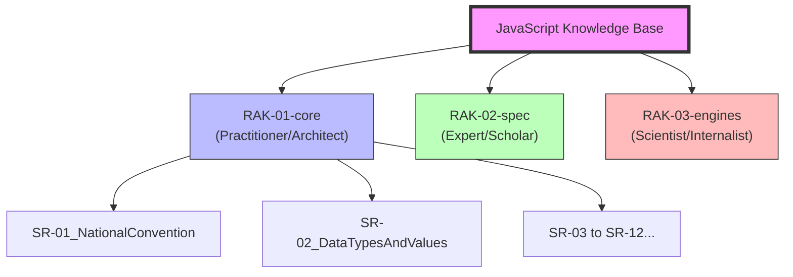

# JavaScript Knowledge Base

JavaScript Knowledge Base adalah sebuah perpustakaan digital interaktif yang dirancang untuk membongkar misteri, mekanisme internal, dan arsitektur inti dari bahasa JavaScript.

Repositori ini secara spesifik bertindak sebagai **"The Brain"** dalam *Master Plan: Polyglot Senior Architect*. Artinya, fokus materi di sini murni pada **Core Language JavaScript** (seperti *Event Loop, V8 Engine, Scope, Asynchronous Mechanics*), dan **bukan** tempat untuk membahas Framework UI (seperti React/Vue) atau Runtime spesifik (seperti Node.js) yang sudah memiliki ekosistem pembelajarannya masing-masing.

## Struktur Perpustakaan (3 Rak Utama)

Untuk membangun kompetensi **Senior Architect**, perpustakaan ini dibagi menjadi 3 Rak besar beralur kedalaman teknis:

1. **Rak `RAK-01-core/` (Level: Practitioner/Architect)**
   *Fokus:* Implementasi teknis mendalam dari pilar bahasa (Execution Context, Object Model, Async). Rak ini menggunakan 12 Sub-Rak yang dipetakan secara granular dari spesifikasi ECMA-262.
2. **Rak `RAK-02-spec/` (Level: Expert/Scholar)**
   *Fokus:* Bedah formal klausa demi klausa dari **ECMA-262 Specification**.
3. **Rak `RAK-03-engines/` (Level: Scientist/Internalist)**
   *Fokus:* Mekanisme fisik mesin eksekusi (V8 Engine, JIT, Memory Management).

 setiap materi di dalam rak tersebut tetap mengikuti hierarki 5-level:
**Rak -> Sub-Rak -> Buku -> Bab -> Section.**

---

## Roadmap & Status Pengembangan

| Rak | Deskripsi | Status |
| :--- | :--- | :--- |
| `RAK-01-core/` | 12 Alur Inti (Notasi s.d Memori) | 2% | [/] In Progress |
| `RAK-02-spec/` | Pemetaan Formal ECMA-262 | *Planned* |
| `RAK-03-engines/` | Bedah V8 & Internals | *Planned* |

*Aturan tata letak lengkap diatur pada folder `docs/`.*

## Visi & Tujuan

Repository ini bukan sekadar tempat menaruh *snippet* kode, melainkan sebuah laboratorium mental. ---
*Dokumentasi Lengkap & Roadmap: [docs/](./docs/)*
