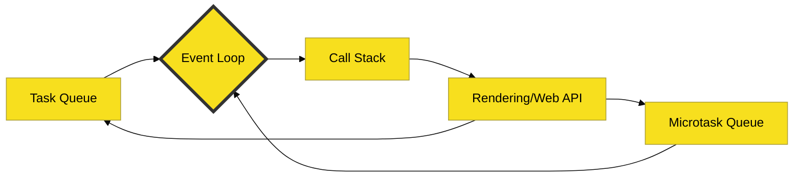

# JavaScript Knowledge Base

> **"Mastering the Web's Kinetic Hub: From Syntax Fuel to Engine Combustion."**

---

## 📢 PENGUMUMAN PENTING: FASE REBUILD / RESTRUCTURE

Repositori ini sedang menjalani **Fase Pembangunan Ulang & Restrukturisasi Besar (Rebuild & Restructure Phase)**. 
Tujuan utama fase ini adalah menyelaraskan kerapian struktur folder dan manajemen workflow mengikuti referensi struktur proyek yang mapan.

> [!IMPORTANT]
> * **Referensi Kerapian:** Pola eksternal HANYA digunakan sebagai pembanding keindahan visual, kerapian tata kelola dokumen kontrol, dan pola `materi/` yang terstruktur. Referensi tersebut **BUKAN** cetakan isi materi. Struktur rak di repositori ini dirancang khusus berdasarkan domain pemrograman JavaScript.
> * **Pusat Kontrol Baru:** Seluruh keputusan, kebijakan scope, alur kerja, dan status aktif dipusatkan di [docs/project/](./docs/project/).
> * **Pusat Pembelajaran Baru:** Seluruh materi pembelajaran dirombak bertahap ke dalam folder [materi/](./materi/).
> * **Folder Legacy:** Folder lama (`RAK-01` s/d `RAK-06`) dipertahankan seutuhnya di level root sebagai **Legacy Source** / bahan migrasi, dan **tidak boleh dihapus** sebelum proses verifikasi selesai.
> * **Status Program (HOLD):** Sektor server, client, database, auth, atau aplikasi frontend/backend berstatus **HOLD** dan ditangguhkan dari ruang lingkup saat ini.

---

## 🏛️ Misi Arsitek JavaScript

**JavaScript** bukan sekadar bahasa scripting biasa; ia adalah runtime asinkron tangguh yang menjadi motor penggerak internet modern. Repositori ini berfungsi sebagai perpustakaan belajar pribadi untuk melakukan dekonstruksi mendalam terhadap ekosistem tersebut melalui prinsip **Spec-Rigor** terhadap spesifikasi resmi **ECMA-262**.

Di sini, fokus utama kita bukan hanya "cara menggunakan sintaks", melainkan membedah secara fundamental *mengapa* sebuah instruksi berperilaku tertentu di level mesin dan bagaimana ia diproses di dalam *Execution Context*.

---

## 🧠 Core DNA: The Event Loop

Mekanisme orkestrasi asinkron JavaScript divisualisasikan secara dinamis melalui siklus Event Loop:

---

## 🗄️ Arsitektur Pusat Kontrol & Pembelajaran Baru

Proyek rebuild ini membagi repositori menjadi dua area utama yang bersih dan teratur:

### 1. Pusat Kontrol Proyek — [docs/project/](./docs/project/)
Area ini memuat berkas-berkas pengarah masa depan proyek agar pengerjaan tetap teratur bebas dari blunder teknis:
* [add-instruksi-chatgpt-project.md](./docs/project/add-instruksi-chatgpt-project.md) — Salinan portable ChatGPT Project Add Instructions.
* [room-context-summary.md](./docs/project/room-context-summary.md) — Ringkasan cepat untuk sinkronisasi Room Chat baru.
* [current-status.md](./docs/project/current-status.md) — Pelacak status terkini pengerjaan real-time.
* [workflow.md](./docs/project/workflow.md) — Definisi peran kolaborasi dan alur riset-penulisan.
* [scope-guard.md](./docs/project/scope-guard.md) — Penjaga batasan ketat pencegah scope creep dan standar kualitas estetika.
* [roadmap-active.md](./docs/project/roadmap-active.md) — Peta tahapan pengerjaan Batch 1 hingga Batch 5.
* [materi-structure-plan.md](./docs/project/materi-structure-plan.md) — Cetak biru pembagian 18 rak pembelajaran baru.
* [migration-policy.md](./docs/project/migration-policy.md) — Kebijakan keselamatan transfer data dari legacy source.
* [room-handoff-batch-10.md](./docs/project/room-handoff-batch-10.md) — Petunjuk serah terima resmi (handoff) untuk sesi room chat baru.

### 2. Perpustakaan Pembelajaran — [materi/](./materi/)
Wadah pembelajaran baru yang tersusun rapi menjadi 18 rak bertahap dari tingkat orientasi dasar hingga tingkat internal mesin (Engine Internals):
* [00 — Index dan Jalur Belajar](./materi/00-index-dan-jalur-belajar/README.md)
* [01 — Orientasi Sejarah dan Fondasi JavaScript](./materi/01-orientasi-sejarah-dan-fondasi-javascript/README.md)
* [02 — JavaScript Core Language](./materi/02-javascript-core-language/README.md)
* [03 — Scope, Closure, This, dan Execution Context](./materi/03-scope-closure-this-dan-execution-context/README.md)
* [04 — Object, Prototype, Class, dan Inheritance](./materi/04-object-prototype-class-dan-inheritance/README.md)
* [05 — Function, Array, Object, dan Built-In API](./materi/05-function-array-object-dan-built-in-api/README.md)
* [06 — Async, Promise, Event Loop, dan Concurrency](./materi/06-async-promise-event-loop-dan-concurrency/README.md)
* [07 — DOM, Browser API, dan Web Platform](./materi/07-dom-browser-api-dan-web-platform/README.md)
* [08 — Modules, Package.json, NPM, dan Tooling](./materi/08-modules-package-json-npm-dan-tooling/README.md)
* [09 — Node.js Runtime dan Server-Side JavaScript](./materi/09-nodejs-runtime-dan-server-side-javascript/README.md)
* [10 — Error Handling, Debugging, dan Testing](./materi/10-error-handling-debugging-dan-testing/README.md)
* [11 — Performance, Memory, dan Engine Internals](./materi/11-performance-memory-dan-engine-internals/README.md)
* [12 — Security dan Safe JavaScript](./materi/12-security-dan-safe-javascript/README.md)
* [13 — TypeScript dan Modern JavaScript Ecosystem](./materi/13-typescript-dan-modern-javascript-ecosystem/README.md)
* [14 — Practical Recipes dan Patterns](./materi/14-practical-recipes-dan-patterns/README.md)
* [15 — Real Project Cases](./materi/15-real-project-cases/README.md)
* [16 — Interview Test dan Cheatsheet](./materi/16-interview-test-dan-cheatsheet/README.md)
* [17 — Berita, Isu, dan Update Ekosistem](./materi/17-berita-isu-dan-update-ekosistem/README.md)

---

## 📈 Status Global & Pelacakan
Progress detail dari pengerjaan proyek rebuild dapat terus ditinjau pada [status.md](./status.md) di level root.

---
*Created with ❤️ by ECMAScript Core Language Architect.*
