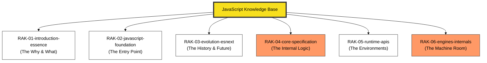

# JavaScript Knowledge Base
 
> **"Mastering the Web's Language: From Syntax to Metaprogramming."**

## 🏛️ Arsitektur 5-Rak (Universal Standard)
Repositori ini menggunakan **5-Rack Universal Architecture** dengan prinsip **Digital Mirroring** untuk memisahkan antara fondasi penggunaan dengan dekonstruksi arsitektur mesin.

---

## 🗄️ Struktur Perpustakaan

### 1. [RAK-01-introduction-essence](./RAK-01-introduction-essence/)
Memahami filosofi, sejarah, dan esensi JavaScript sebagai bahasa web.

### 2. [RAK-02-javascript-foundation](./RAK-02-javascript-foundation/)
Seluruh sintaks dan fitur standar JavaScript (MDN-Mirror).

### 3. [RAK-03-evolution-esnext](./RAK-03-evolution-esnext/)
Evolusi bahasa, proses TC39, dan fitur-fitur masa depan (ESNext).

### 4. [RAK-04-core-specification](./RAK-04-core-specification/)
Dekonstruksi teknis **ECMA-262**. Membedah algoritma, memori, dan internal spesifikasi.

### 5. [RAK-05-runtime-apis](./RAK-05-runtime-apis/)
Eksplorasi lingkungan eksekusi: Node.js, Bun, Deno, dan Web Platform APIs.

### 6. [RAK-06-engines-internals](./RAK-06-engines-internals/)
Deep dive ke dalam mesin JavaScript (**V8 Engine**, JIT, Garbage Collection).

---

## 📏 Standar Kualitas (Gold Standard)
Setiap materi mengikuti prinsip **Digital Mirroring** dan standar **PPM V4** yang mewajibkan:
1. **Source-Synced**: Akurasi 1:1 terhadap dokumentasi resmi/spesifikasi.
2. **Experimental Lab**: Kode pembuktian fungsional di folder `examples/`.
3. **Mental Model Visual**: Diagram Mermaid di folder `assets/`.
4. **Narrative Excellence**: Penjelasan mendalam dengan analogi dunia nyata.

*Dokumentasi Lengkap Standar: [docs/standards/architecture.md](./docs/standards/architecture.md)*

---
*Status Pengembangan: [status.md](./status.md)*
