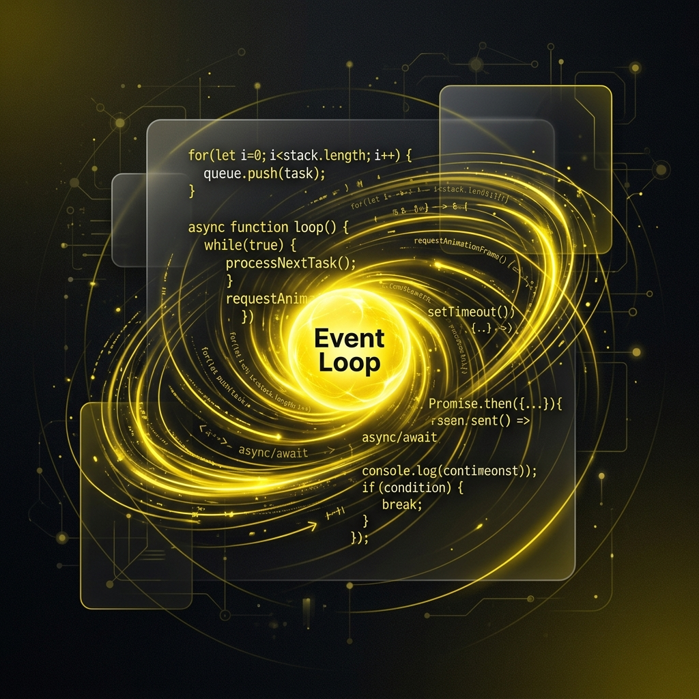
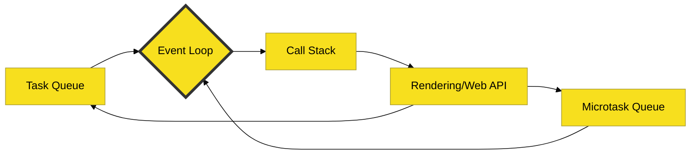
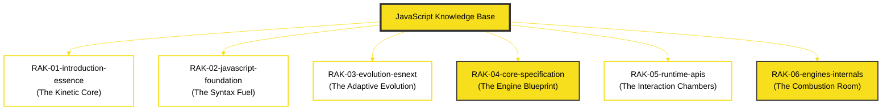

# JavaScript Knowledge Base

> **"Mastering the Web's Kinetic Hub: From Syntax Fuel to Engine Combustion."**

---

## 🌐 Strategic Parent
Repositori ini adalah pendalaman teknis (Workspace) yang terhubung ke peta induk:
**[Strategic Blueprint: JavaScript Node](file:///i:/Workspace/Workspace-Syahputrawork/learning-matrix-blueprint/01-Language-Hubs/JavaScript-Knowledge-Base.md)**

---

## 🔌 Hub Connections
Sebagai fondasi utama *web-native computing*, JavaScript di dalam Learning Matrix terhubung ke:
- **Execution Hubs**: `Browser Runtime`, `Server Runtime`.
- **Digital UI Hubs**: Browser-native interactions & Frontend ecosystems.
- **Architecture Hubs**: `Design Patterns`, `Repository Architecture`.
- **Infrastructure Hubs**: `Toolchains`, `Bundling`, `Runtime Operations`.
- **AI Orchestration**: Logic drafting, Component reasoning, & Async flows.

---

## 🏛️ The Architect's Mission

**JavaScript** bukan sekadar bahasa pemrograman; ia adalah mesin asinkron yang menggerakkan internet modern. Repositori ini didedikasikan untuk melakukan dekonstruksi mendalam terhadap mekanisme tersebut melalui prinsip **Digital Mirroring** terhadap spesifikasi resmi **ECMA-262**.

Di sini, kita tidak belajar "cara pakai" secara umum, melainkan membedah alasan *mengapa* sebuah instruksi berperilaku tertentu di level mesin dan bagaimana ia mengalir di dalam *Execution Context*.

---

## 🧠 Core DNA: The Event Loop

Intuisi utama dari repositori ini adalah memahami bahwa JavaScript hidup di dalam siklus energi yang terus berputar:

---

## 🗼 Arsitektur 6-Rak (Universal Standard)

Seluruh pengetahuan didekonstruksi ke dalam 6 lapisan logis untuk menjaga kejernihan mental model:

---

## 🗄️ Struktur Perpustakaan

### 1. [RAK-01: Introduction & Essence](./RAK-01-introduction-essence/)
Memahami filosofi, lansekap industri (**Industry Position**), esensi JS sebagai bahasa web, dan karakter uniknya sebagai bahasa **Multi-runtime**.

### 2. [RAK-02: JavaScript Foundation](./RAK-02-javascript-foundation/)
Sintaks inti, scope, **Closures, Functions, Objects, dan Arrays** (MDN-Synced).

### 3. [RAK-03: Evolution & ESNext](./RAK-03-evolution-esnext/)
Sejarah TC39, evolusi fitur, dan **History of JS changes** dari masa ke masa.

### 4. [RAK-04: Core Specification (Spec-Rigor)](./RAK-04-core-specification/)
Dekonstruksi teknis **ECMA-262**: **Lexical Environment, Coercion, Prototype Chain**, Execution Contexts, dan Semantics.

### 5. [RAK-05: Runtime APIs](./RAK-05-runtime-apis/)
Lingkungan interaksi: **Async APIs, Timers, Fetch, Network**, dan batas antara **Core Language vs Runtime Facilities** (Browser, Node, Bun, Deno).

### 6. [RAK-06: Engines & Internals](./RAK-06-engines-internals/)
Dapur mesin: **V8 Engine**, JIT Compilation, **Hidden Classes, Optimization Model**, dan Memory Management.

---

## 🧭 Gerbang Dokumentasi Pilar (SSOT)

Untuk menjaga kualitas **Gold Standard**, seluruh pengerjaan wajib mematuhi 4 pilar standar kami:

| Pilar | Deskripsi |
| :--- | :--- |
| 🏗️ **[Repository Standards](./docs/standards/repository-standards.md)** | Aturan Hierarki 6-Level & Konvensi Penamaan. |
| ✍️ **[Content Workflow](./docs/standards/content-workflow.md)** | Riset (Rule 0), PPM V4, & 8-Point README. |
| 🎨 **[Aesthetics & Tone](./docs/standards/aesthetics-and-tone.md)** | Visual Branding (JS Yellow) & Kinetic Tone. |
| 🤝 **[Contribution Guide](./docs/standards/contribution-guide.md)** | Standar kualitas untuk kontribusi teknis. |

---

## 📊 Status Pengembangan

Pelacakan progress global dapat dilihat pada: **[status.md](./status.md)**

---
*Created with ❤️ by ECMAScript Core Language Architect.*
