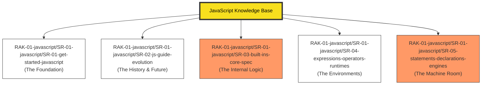

# JavaScript Knowledge Base

> **"Mastering the Web's Language: From Syntax to Metaprogramming."**

## 🏛️ Arsitektur 5-Rack (The Universe Standard)
Repositori ini menggunakan struktur **5-Rack Architecture** yang terstandarisasi untuk memisahkan antara fondasi penggunaan (Application Layer) dengan dekonstruksi arsitektur (Architectural Layer).

---

## 🗄️ Struktur Perpustakaan

### 1. [RAK-01-javascript/SR-01-javascript/SR-01-get-started-javascript](./RAK-01-javascript/SR-01-javascript/SR-01-get-started-javascript/)
Wadah utama untuk seluruh sintaks dan fitur standar JavaScript (MDN-Mirror).
- **SR-01 s/d SR-10**: Kedalaman materi dari pemula hingga Advanced Features (Metaprogramming).

### 2. [RAK-01-javascript/SR-01-javascript/SR-02-js-guide-evolution](./RAK-01-javascript/SR-01-javascript/SR-02-js-guide-evolution/)
Membahas sejarah ECMAScript, proses TC39, dan fitur-fitur masa depan (ESNext).

### 3. [RAK-01-javascript/SR-01-javascript/SR-03-built-ins-core-spec](./RAK-01-javascript/SR-01-javascript/SR-03-built-ins-core-spec/)
Dekonstruksi teknis **ECMA-262**. Membedah algoritma, memori, dan internal spesifikasi secara presisi.

### 4. [RAK-01-javascript/SR-01-javascript/SR-04-expressions-operators-runtimes](./RAK-01-javascript/SR-01-javascript/SR-04-expressions-operators-runtimes/)
Eksplorasi lingkungan eksekusi modern: Node.js, Bun, dan Deno.

### 5. [RAK-01-javascript/SR-01-javascript/SR-05-statements-declarations-engines](./RAK-01-javascript/SR-01-javascript/SR-05-statements-declarations-engines/)
Deep dive ke dalam mesin JavaScript (V8, JIT Compilation, Garbage Collection).

---

## 📏 Standar Kualitas (Gold Standard)
Setiap materi di RAK 02-05 mengikuti **Advanced-Rack Standard** yang mewajibkan adanya:
1. **Dual Definition**: Logika Murni + Analogi Dunia Nyata.
2. **Internal Mechanics**: Algoritma langkah-demi-langkah.
3. **Experimental Lab**: Kode bukti di dalam folder `examples/`.

*Dokumentasi Lengkap Standar: [docs/standards/advanced-rack-standard.md](./docs/standards/advanced-rack-standard.md)*

---
*Status Pengembangan: [status.md](./status.md)*
