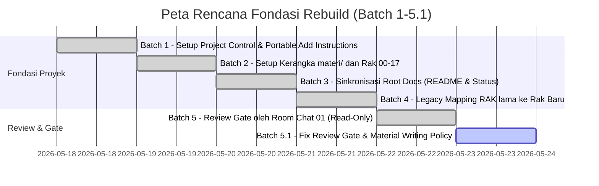

# Roadmap Aktif — JavaScript Knowledge Base Rebuild

Dokumen ini memetakan rencana kerja terstruktur dari Batch 1 hingga Batch 5.1. Tahapan ini difokuskan penuh untuk membangun fondasi arsitektur dan kontrol proyek sebelum migrasi materi detail dimulai.

---

## 1. Rencana Perjalanan Batch (Batches 1 - 5.1)

### [Batch 1] — Setup Project Control & Portable Add Instructions
* **Tujuan:** Membuat fondasi awal kontrol proyek di `docs/project/` agar pengerjaan tetap rapi walaupun sesi chat berganti.
* **Status:** `SELESAI / COMMITTED`
* **Output:** Pembuatan dokumen instruksi portable, ringkasan konteks room, status, roadmap aktif, rencana rak, dan kebijakan migrasi.

### [Batch 2] — Setup Kerangka `materi/` dan Rak 00–17
* **Tujuan:** Menginisialisasi 18 rak pembelajaran baru (Rak 00 s/d 17) sebagai wadah penampung materi yang terstruktur.
* **Status:** `SELESAI / COMMITTED`
* **Output:** Folder kosong/placeholder untuk masing-masing rak beserta file `README.md` awal di setiap rak yang menjelaskan cakupan bahasannya.

### [Batch 3] — Sinkronisasi Root Docs: README, FITUR, dan Status
* **Tujuan:** Merapikan dokumen di level root (`README.md`, `FITUR.md`, dan `status.md`) agar selaras dengan fase rebuild yang sedang berjalan serta membersihkan berkas kontrol lama.
* **Status:** `SELESAI / COMMITTED`
* **Output:** Sinkronisasi deskripsi proyek, status pencapaian, dan pembaruan visual agar konsisten dengan gaya visual premium, serta menghapus `.cursorrules`, `docs/README.md` lama, dan folder `docs/standards/`.

### [Batch 4] — Docs Identity Cleanup, Docs README Baru, Link Hygiene, dan Legacy Mapping
* **Tujuan:** Merapikan identitas proyek JavaScript, menyusun pintu gerbang [docs/README.md](../README.md) baru, membersihkan absolute `file:///` URLs, dan merancang peta pemetaan awal legacy source ke rak baru.
* **Status:** `SELESAI / COMMITTED`
* **Output:** Pembersihan nama repositori pembanding eksternal di semua dokumen aktif, penetapan catatan netral untuk penulisan standar, pembersihan absolute links ke relative links, pembuatan berkas navigasi docs, dan penyusunan [legacy-to-materi-mapping.md](./legacy-to-materi-mapping.md).

### [Batch 5] — Review Gate oleh Room Chat 01
* **Tujuan:** Melakukan audit menyeluruh terhadap hasil pengerjaan Batch 1 hingga Batch 4 secara read-only untuk memastikan tidak ada blunder teknis sebelum migrasi konten dimulai.
* **Status:** `REVIEW GATE SELESAI / STATUS NEEDS FIX RINGAN`
* **Output:** Laporan audit independen dari Room Chat 01 dan daftar koreksi status.md, roadmap, typo, serta kebutuhan formalisasi kebijakan migrasi.

### [Batch 5.1] — Fix Review Gate Notes & Dokumentasi Kebijakan Migrasi Materi
* **Tujuan:** Memperbaiki seluruh temuan audit Batch 5, menyelaraskan sinkronisasi `status.md` dan `roadmap-active.md`, serta mendokumentasikan kebijakan penangguhan materi baru dan regulasi penghapusan legacy `RAK-*` bertahap di bawah [Material Writing Policy](./material-writing-policy.md).
* **Status:** `SELESAI DIEKSEKUSI` (Oleh Gemini 3 Flash, Siap Direview).
* **Output:** Sinkronisasi menyeluruh status, pembersihan sisa nama repo pembanding eksternal, koreksi relative links mapping di `migration-policy.md`, dan pembuatan berkas kebijakan penulisan formal.

---

## 2. Catatan Penting Prosedur

> [!IMPORTANT]
> * **Tahap Fondasi:** Batch 1 sampai Batch 5.1 adalah pembentukan fondasi struktural, pembersihan tautan, penyusunan peta mapping, dan arsitektur kontrol proyek yang kini siap dipause dengan aman.
> * **Review Gate:** Batch 5 bersifat **Read-Only (Audit)**. Seluruh catatan perbaikan diselesaikan di Batch 5.1.
> * **Migrasi Konten:** Migrasi detail materi pembelajaran dari folder lama **hanya boleh dimulai** setelah project diaktifkan kembali dan standar penulisan baru disepakati di Room Chat 00 sesuai [Material Writing Policy](./material-writing-policy.md).
