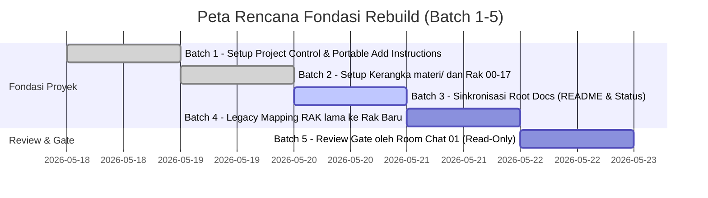

# Roadmap Aktif — JavaScript Knowledge Base Rebuild

Dokumen ini memetakan rencana kerja terstruktur dari Batch 1 hingga Batch 5. Tahapan ini difokuskan penuh untuk membangun fondasi arsitektur dan kontrol proyek sebelum migrasi materi detail dimulai.

---

## 1. Rencana Perjalanan Batch (Batches 1 - 5)

### [Batch 1] — Setup Project Control & Portable Add Instructions
* **Tujuan:** Membuat fondasi awal kontrol proyek di `docs/project/` agar pengerjaan tetap rapi walaupun sesi chat berganti.
* **Status:** `SELESAI / COMMITTED`
* **Output:** Pembuatan dokumen instruksi portable, ringkasan konteks room, status, workflow, scope guard, roadmap aktif, rencana rak, dan kebijakan migrasi.

### [Batch 2] — Setup Kerangka `materi/` dan Rak 00–17
* **Tujuan:** Menginisialisasi 18 rak pembelajaran baru (Rak 00 s/d 17) sebagai wadah penampung materi yang terstruktur.
* **Status:** `SELESAI / COMMITTED`
* **Output:** Folder kosong/placeholder untuk masing-masing rak beserta file `README.md` awal di setiap rak yang menjelaskan cakupan bahasannya.

### [Batch 3] — Sinkronisasi Root Docs: README, FITUR, dan Status
* **Tujuan:** Merapikan dokumen di level root (`README.md`, `FITUR.md`, dan `status.md`) agar selaras dengan fase rebuild yang sedang berjalan serta membersihkan kontrol lama.
* **Status:** `SELESAI DIEKSEKUSI` (Oleh Gemini 3 Flash, Siap Direview).
* **Output:** Sinkronisasi deskripsi proyek, status pencapaian, dan pembaruan visual agar konsisten dengan gaya visual premium, serta menghapus `.cursorrules`, `docs/README.md`, dan folder `docs/standards/`.

### [Batch 4] — Legacy Mapping dari RAK lama ke Rak Baru
* **Tujuan:** Membuat peta jalan (mapping) pemindahan konten secara detail dari RAK lama (RAK 01 - RAK 06) ke rak baru yang dirancang (Rak 00 - 17).
* **Status:** `BELUM DIMULAI`.
* **Output:** Dokumen `docs/project/legacy-mapping.md` yang memetakan file mana di folder lama yang akan dipindahkan ke folder baru mana.

### [Batch 5] — Review Gate oleh Room Chat 01
* **Tujuan:** Melakukan audit menyeluruh terhadap hasil pengerjaan Batch 1 hingga Batch 4 secara read-only untuk memastikan tidak ada blunder teknis sebelum migrasi konten dimulai.
* **Status:** `BELUM DIMULAI`.
* **Output:** Laporan audit independen dari Room Chat 01 dan persetujuan formal dari Room Chat 00 untuk memulai fase migrasi.

---

## 2. Catatan Penting Prosedur

> [!IMPORTANT]
> * **Tahap Fondasi:** Batch 1 sampai Batch 4 adalah pembentukan fondasi struktural dan arsitektur kontrol proyek.
> * **Review Gate:** Batch 5 bersifat **Read-Only (Audit)**. Tidak boleh ada pembuatan/perubahan file kode di Batch 5.
> * **Migrasi Konten:** Migrasi detail materi pembelajaran dari folder lama **hanya boleh dimulai** setelah Batch 5 diselesaikan dan disetujui (accepted) oleh Room Chat 00.
