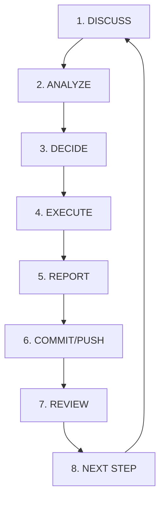

# Workflow Kerja — JavaScript Knowledge Base Rebuild

Dokumen ini mendefinisikan workflow kerja dan pembagian peran (roles) untuk memastikan proses rebuild berjalan dengan rapi, terstruktur, serta menghindari kesalahan teknis (anti-blunder).

---

## 1. Pembagian Peran (Roles)

Proyek ini dikelola secara kolaboratif menggunakan pembagian peran berikut:

| Peran (Role) | Entitas | Tanggung Jawab Utama | Sifat Akses |
| :--- | :--- | :--- | :--- |
| **Room Chat 00** | ChatGPT Project (Control) | Pengambil keputusan final, scope guard, pengarah roadmap, evaluator, dan pembuat instruksi (prompt) final untuk executor. | Project Control |
| **Room Chat 01** | ChatGPT Project (Analisa) | Menganalisa repositori secara mendalam, melakukan review hasil kerja executor secara objektif, dan memberikan laporan berkala. | Read-Only |
| **Gemini 3 Flash** | AI Engine / IDE Agent | Bertindak sebagai **Executor** yang menerima satu instruksi per batch, melakukan eksekusi, menjalankan smoke test ringan, dan melaporkan hasilnya. | Read & Write (Executor) |
| **User** | Pemilik Proyek (Human) | Melakukan review akhir, memberikan persetujuan (approval) keputusan, dan melakukan commit serta push secara manual ke GitHub. | Owner / Operator |

---

## 2. Alur Kerja (Workflow Steps)

Setiap siklus pengerjaan batch harus melewati 8 tahapan terstruktur berikut:

### 1. DISCUSS (Diskusi Awal)
* User dan Room Chat 00 mendiskusikan rencana atau ide baru untuk kelanjutan proyek.
* Memastikan ide selaras dengan tujuan rebuild dan tidak melanggar batasan scope.

### 2. ANALYZE (Analisa Keadaan)
* Room Chat 01 menganalisa keadaan repositori saat ini untuk melihat kelayakan, kesiapan kode, map materi, atau potensi hambatan.
* Room Chat 01 mengeluarkan laporan analisa teknis yang objektif.

### 3. DECIDE (Keputusan Arah & Instruksi)
* Room Chat 00 mengambil keputusan final berdasarkan laporan analisa Room Chat 01.
* Room Chat 00 menyusun instruksi (prompt) pengerjaan tunggal yang presisi dan aman untuk Executor (Gemini 3 Flash).

### 4. EXECUTE (Eksekusi Batch)
* Executor (Gemini 3 Flash) menerima instruksi dari User (yang di-copy dari Room Chat 00).
* Gemini melakukan perubahan repositori secara fokus pada batch yang diminta, tidak meluas ke area lain.

### 5. REPORT (Laporan Pengerjaan)
* Gemini melaporkan hasil kerjanya secara jujur dan menyertakan hasil smoke test ringan (misalnya `git status` atau cek keberadaan file).
* **Catatan Penting:** Gemini *tidak boleh* mengklaim hasil pekerjaannya sudah "final", "verified", atau "release-ready".

### 6. COMMIT/PUSH (Penyimpanan Manual)
* User meninjau secara cepat laporan dari Gemini di repositori lokal.
* User secara manual menjalankan `git add`, `git commit`, dan `git push` ke GitHub sebagai *Source of Truth*.

### 7. REVIEW (Pemeriksaan Independen)
* Room Chat 01 membaca repositori terbaru setelah push untuk melakukan review gate secara read-only.
* Room Chat 01 memverifikasi apakah eksekusi sesuai instruksi, rapi, dan bebas blunder.

### 8. NEXT STEP (Melangkah ke Batch Berikutnya)
* Room Chat 00 menerima laporan review dari Room Chat 01.
* Room Chat 00 menyatakan batch tersebut selesai (accepted) dan mempersiapkan instruksi untuk batch berikutnya.

---

## 3. Catatan & Kebijakan Keamanan

> [!WARNING]
> * **Review Gate:** Gemini 3 Flash hanya berperan sebagai Executor. Gemini tidak boleh mengambil alih peran reviewer akhir. Review gate wajib dilewati melalui verifikasi Room Chat 01 dan keputusan akhir Room Chat 00.
> * **Pencegahan Loop:** Jangan pernah membuat instruksi yang memaksa Gemini melakukan analisa berulang-ulang tanpa aksi konkret, atau terjebak dalam looping perbaikan kode.

---

## 4. Alur Riset & Penulisan Materi (PPM V4)

Setiap penyusunan materi final (README.md di subfolder bab) harus mengikuti tahapan penulisan berikut demi menjaga kualitas **Gold Standard**:

1. **Source Alignment & Spec-Rigor:** Menghubungkan bahasan dengan link spesifikasi resmi (ECMA-262 / MDN) untuk akurasi mutlak.
2. **Konsep & Esensi (Dual Definition):** Menyajikan definisi formal dan analogi model mental yang mudah dipahami.
3. **Visualisasi Sistem (Mermaid):** Menyediakan diagram alur eksekusi/representasi memori secara **inline** di dalam berkas markdown.
4. **Mekanisme Pembuktian (Under-The-Hood):** Menjelaskan bagaimana JavaScript Engine (V8/Libuv) mengeksekusi kode di balik layar.
5. **Lab Praktis & Pitfalls:** Mengaitkan dengan contoh kode nyata serta mendokumentasikan jebakan (anti-patterns) umum.

