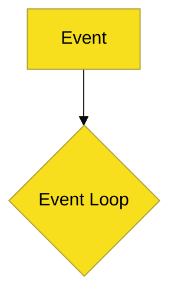

# Aesthetics & Tone: Visual & Verbal Identity

Dokumen ini mengatur identitas visual (Branding) dan gaya bahasa (Tone) untuk menjaga konsistensi repositori JavaScript Knowledge Base.

---

## 🎨 1. Estetika Visual (Branding)

### Skema Warna Utama
- **Primary Color**: `#F7DF1E` (JS Yellow) - Digunakan untuk aksen dan elemen kunci.
- **Secondary Color**: `#000000` (Classic Black) - Dasar tipografi.

### Standar Diagram Mermaid
Diagram harus menggunakan tema seragam untuk keterbacaan tinggi:

### Simbol Visual (Mental Models)
- **Lingkaran Berputar**: Mewakili Event Loop.
- **Warna Kuning**: Digunakan untuk elemen Blocking/Synchronous.
- **Warna Transparan/Cyan**: Digunakan untuk elemen Background/Asynchronous.

---

## 🗣️ 2. Tone Suara & Terminologi (Verbal)

### Gaya Bahasa "Kinetic"
Gunakan kata kerja aktif untuk mencerminkan dinamisme web:
- Gunakan: *"Dispatched"*, *"Invoked"*, *"Transmuted"*, *"Resolved"*.

### Akurasi Spesifikasi (Senior Terms)
Gunakan terminologi teknis yang tepat untuk rigoritas senior:
- **Closures** (bukan sekadar fungsi dalam fungsi).
- **Prototypal Inheritance** (bukan warisan biasa).
- **Lexical Scope** (bukan jangkauan variabel).

---

## 🧠 3. Core DNA Thinking (Mental Models)

Setiap materi yang ditulis wajib mencerminkan pilar DNA JavaScript berikut:

### I. Execution & Event Model
Visualisasikan aliran eksekusi melalui empat elemen:
- **Call Stack**: Antrean eksekusi sinkron.
- **Event Loop**: Jantung orkestrasi asinkron.
- **Task Queue**: Callback dari API eksternal/Timer.
- **Microtask Queue**: Prioritas tinggi (Promises/MutationObservers).

### II. Object & Scope Model
Gunakan perspektif internal untuk menjelaskan:
- **Lexical Scoping & Closures**: Dasar dari enkapsulasi dan privasi data.
- **Prototype Chain**: Mekanisme delegasi state dan behavior antar objek.
- **First-class Functions**: Fungsi sebagai "Warga Negara Utama" dalam bahasa.

### III. Multi-Paradigm Flexibility
Tunjukkan fleksibilitas JavaScript dalam mendukung gaya:
- **Functional**: (Map, Filter, Reduce, Pure Functions).
- **Object-Oriented**: (Classes, Prototypes, Composition).
- **Event-Driven**: (Listeners, Emitters, Reactive Flows).

---
| Term | Analogi | Keterangan |
| :--- | :--- | :--- |
| **RAK (Rack)** | Domain | Area ilmu besar (Level 2). |
| **SR (Sub-Rack)** | Track | Jalur spesifik di dalam domain (Level 3). |
| **BK (Book)** | Koleksi | Modul utuh yang terdiri dari bab (Level 4). |
| **CH (Chapter)** | Materi | Unit pengerjaan teknis (Level 5). |
| **SEC (Section)** | Detil | Kedalaman spesifik (Level 6). |
