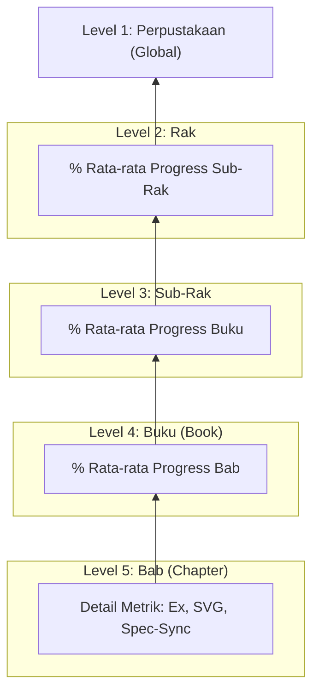

# Arsitektur & Hierarki Struktur

Proyek **JavaScript Knowledge Base** disusun dengan analogi **Perpustakaan Digital** untuk merombak struktur dokumentasi teknis (*ECMAScript Spec*) yang kaku menjadi unit pelajaran yang manusiawi.

## Analogi Struktur

Berikut adalah pemetaannya ke dalam direktori bertingkat:

| Tingkatan | Analogi | Contoh Direktori | Keterangan |
| :--- | :--- | :--- | :--- |
| **Level 1** | **Perpustakaan** | `/` (root) | Seluruh sistem proyek. |
| **Level 2** | **Rak (Shelf)** | `RAK-01-core/` | Rak utama pembeda kedalaman ilmu. |
| **Level 3** | **Sub-Rak (Sub-shelf)** | `SR-01_NationalConvention/` | Grup materi berbasis Clause spesifik. |
| **Level 4** | **Buku (Book)** | `BK-01_SpecFoundations/` | Koleksi bab yang membentuk satu topik besar. |
| **Level 5** | **Bab (Chapter)** | `CH-01_Overview/` | Unit terkecil wajib (Folder Bab). |
| **Level 6** | **Section (Sub-bab)** | `SEC-01_SubTopic/` | **Opsional**: Digunakan jika Bab terlalu kompleks. |

---

## Aturan Pewajiban `README.md`

Guna memudahkan orientasi, setiap tingkatan direktori **WAJIB** memiliki file `README.md`:

- **Root (`/README.md`)**: Visi keseluruhan perpustakaan (3 Pilar Rak).
- **Rak (`RAK-XX/README.md`)**: Tujuan dan cakupan Rak tersebut.
- **Buku (`BK-XX/README.md`)**: Pengantar materi dan daftar bab di dalamnya.
- **Section (`SEC-XX/README.md`)**: Penjelasan spesifik sub-topik (jika menggunakan Level 6).

---

## Standar File `status.md`

Setiap `status.md` (Level Buku) wajib menggunakan kolom berikut:
`| Bab | Judul | Status | Ex | SVG | Spec-Sync |`

Dan dilengkapi dengan:
1.  **Spec-Sync**: Mencantumkan versi spesifikasi standar (misal: `ES2024`, `ES2025`) yang digunakan sebagai acuan terakhir.
2.  **Penyebutan Clause**: Setiap bab wajib menyebutkan nomor Clause spesifik di awal `README.md` untuk memudahkan audit ulang jika nomor klausul di spek resmi berubah.

---

## Sistem Status Berjenjang (Bubbling Up)

Kemajuan proyek tidak diukur secara manual di tingkat atas, melainkan "menguap" (*bubbling up*) dari unit terkecil (Bab) hingga ke tingkat Perpustakaan (Root). Ini menjamin akurasi data yang mencerminkan realitas di lapangan.

### Rumus Agregasi:
1.  **Level Bab**: Status kualitatif (`Sync`, `Partial`, `Draft`) dan kuantitatif (Jumlah Contoh & SVG).
2.  **Level Buku**: `(Σ % Progress Bab) / (Total Bab)`. Ditulis dalam format persentase di `docs/status.md` Buku.
3.  **Level Sub-Rak**: `(Σ % Progress Buku) / (Total Buku)`. Diperbarui di `docs/status.md` Sub-Rak.
4.  **Level Rak**: `(Σ % Progress Sub-Rak) / (Total Sub-Rak)`. Diperbarui di `docs/status.md` Rak.

---

## Kriteria "Gold Standard" (100% Complete)

Sebuah unit baru dianggap **Completed** jika dan hanya jika memenuhi 4 pilar kualitas:

> [!IMPORTANT]
> **Pilar 1: Spec-Sync Accurate**  
> Konten telah diverifikasi terhadap Clause spesifik di ECMA-262 (Versi Target di kolom Spec-Sync).
>
> **Pilar 2: Functional Examples**  
> Minimal terdapat 1 contoh kode (`.js`) di folder `examples/` yang membuktikan konsep tersebut bekerja di runtime.
>
> **Pilar 3: Mental Model Visual**  
> Terdapat minimal 1 diagram (Mermaid/SVG) di folder `assets/` yang menjelaskan alur logika secara visual.
>
> **Pilar 4: Narrative Excellence**  
> Penjelasan menggunakan standar PPM V4: Bahasanya manusiawi, ada analogi, dan menyertakan "Architect Mindset".
