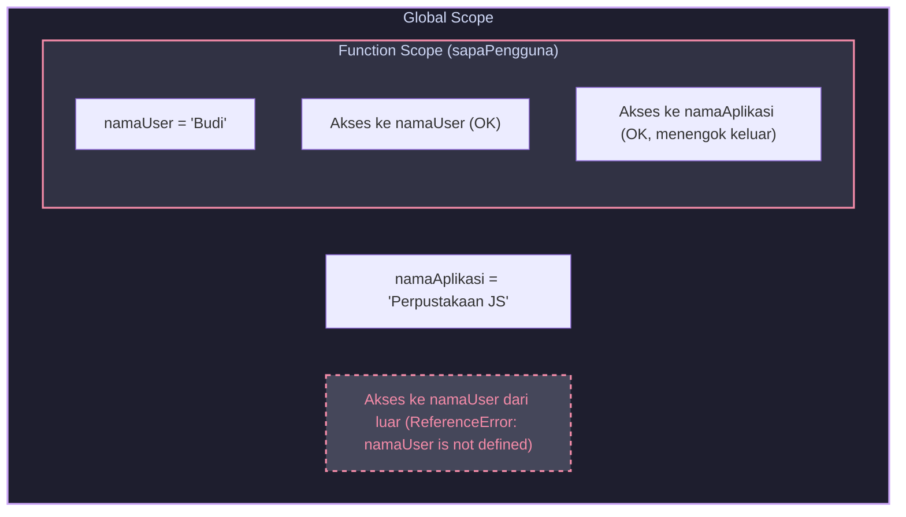

# Bab 01 — Apa Itu Scope?

Di JavaScript, variabel tidak berkeliaran secara bebas tanpa aturan. Ada pagar gaib yang membatasi di mana suatu variabel boleh dibaca dan di mana ia sama sekali tidak terlihat. Pagar gaib ini disebut **Scope**.

---

## Tujuan Bab
Setelah membaca bab ini, Anda akan:
*   Paham definisi dasar **Scope** sebagai sistem aturan aksesibilitas variabel di JavaScript.
*   Mengerti mengapa scope sangat penting untuk mencegah terjadinya bentrok nama variabel (*name collisions*).
*   Mampu membedakan kondisi "variabel ada di memori" dengan "variabel bisa diakses dari baris kode saat ini".
*   Dapat mengidentifikasi dan memecahkan bug sederhana akibat pelanggaran batasan scope.

---

## Inti Cepat
> **Scope** adalah hukum/aturan yang menentukan di mana suatu variabel atau fungsi dapat diakses di dalam kode Anda. Jika Anda mencoba membaca variabel di luar wilayah kekuasaannya (scope-nya), JavaScript engine akan melemparkan kesalahan fatal: `ReferenceError`.

---

## Masalah yang Diselesaikan
Tanpa adanya konsep Scope, semua variabel di dalam program Anda akan bersifat global. Bayangkan jika Anda memiliki proyek besar dengan puluhan ribu baris kode dan puluhan library pihak ketiga, lalu semua orang membuat variabel bernama `userData` atau `counter`. 

Apa yang terjadi?
1.  **Name Collision (Bentrok Nama):** Variabel di satu bagian kode akan secara tidak sengaja menimpa isi variabel di bagian kode lain.
2.  **State Pollution (Polusi State):** Sulit melacak bagian kode mana yang mengubah nilai suatu variabel karena semua baris kode memiliki izin untuk menulis ke variabel tersebut.
3.  **Memori Boros:** Semua variabel akan terus hidup di dalam memori sejak aplikasi dinyalakan hingga dimatikan karena tidak ada batasan masa hidup variabel.

Scope memecahkan masalah ini dengan memberikan "kartu izin akses khusus" pada setiap variabel yang Anda buat.

---

## Analogi
Bayangkan **Scope** seperti **ruangan di dalam rumah**. 

*   Jika Anda berada di dalam kamar tidur tertutup (scope dalam), Anda bisa melihat semua barang yang ada di dalam kamar tidur tersebut.
*   Jika Anda butuh barang yang tidak ada di dalam kamar tidur, Anda boleh membuka pintu kamar dan melihat ke ruang tamu (scope luar) untuk mencarinya.
*   Namun, orang yang berdiri di ruang tamu (scope luar) **tidak bisa melihat** barang berharga Anda yang tersimpan rapat di dalam laci kamar tidur tertutup Anda (scope dalam). Pintu kamar mengunci visibilitas dari luar ke dalam.

---

## Batas Analogi
Analogi ruangan sangat bagus untuk menggambarkan arah aksesibilitas spasial. Namun, analogi ini **gagal** menjelaskan aspek dinamis runtime:
*   Di dunia nyata, Anda bisa berjalan bolak-balik antar ruangan secara fisik kapan saja.
*   Di JavaScript, arah pencarian variabel ditentukan secara statis saat kode ditulis (lexical compile time), bukan saat fungsi dipanggil bolak-balik secara dinamis. Anda tidak bisa "berjalan masuk" ke scope fungsi lain secara dinamis.
*   Analogi ini juga tidak menjelaskan struktur data internal seperti *Environment Record* yang menyimpan nama variabel di memori.

---

## Penjelasan Naratif
Ketika Anda menulis kode JavaScript, Anda sebenarnya sedang membangun wilayah-wilayah kekuasaan. Wilayah terluar adalah jalan raya umum (Global Scope). Setiap kali Anda membuat fungsi baru, Anda sedang membangun rumah kecil tertutup dengan gerbang satu arah. 

Variabel yang dideklarasikan di dalam rumah tersebut terlindungi dari pengaruh buruk luar. Kode di luar rumah tidak bisa menyentuhnya. Sebaliknya, kode di dalam rumah tetap bisa menengok ke luar gerbang untuk membaca variabel yang ada di jalan raya umum jika dibutuhkan. Hal ini memunculkan aturan emas aksesibilitas JavaScript: **Akses dari dalam ke luar diperbolehkan, tetapi akses dari luar ke dalam dilarang keras.**

---

## Penjelasan Teknis
Secara teknis di dalam engine JavaScript (seperti V8), scope diwujudkan melalui struktur data internal yang disebut **Lexical Environment** (Lingkungan Leksikal). Setiap kali engine mengeksekusi blok kode atau fungsi, engine akan membuat objek Lexical Environment baru yang terdiri dari dua komponen utama:
1.  **Environment Record (Catatan Lingkungan):** Sebuah tempat penyimpanan internal (mirip map/key-value store) yang mencatat semua variabel dan fungsi yang dideklarasikan di dalam scope tersebut.
2.  **Outer Reference (Referensi Luar):** Tautan (pointer) yang menunjuk ke Lexical Environment di luarnya secara hierarkis.

Ketika kode Anda mencoba mengakses variabel `x`, engine pertama kali akan memeriksa *Environment Record* di lingkungannya saat ini. Jika tidak ditemukan, engine akan mengikuti *Outer Reference* ke lingkungan luar dan memeriksa record di sana. Proses penelusuran ini berlanjut terus ke luar hingga mencapai Global Environment. Jika di Global Environment pun variabel `x` tetap tidak ditemukan, engine terpaksa melemparkan kesalahan `ReferenceError: x is not defined`.

---

## Contoh Kode

Berikut adalah demonstrasi sederhana bagaimana fungsi membatasi akses variabel:

```javascript
// Wilayah Luar (Global Scope)
const namaAplikasi = "Perpustakaan JS";

function sapaPengguna() {
  // Wilayah Dalam (Function Scope milik sapaPengguna)
  const namaUser = "Budi";
  
  console.log("Halo, " + namaUser); // OK: namaUser ada di scope lokal
  console.log("Selamat datang di " + namaAplikasi); // OK: namaAplikasi ada di scope luar (global)
}

sapaPengguna();

// Mencoba mengakses variabel dari wilayah dalam dari luar
console.log(namaUser); // ERROR!
```

---

## Bedah Kode
Mari kita bedah jalannya baris-baris kode di atas:
*   **Baris 2 (`const namaAplikasi = ...`):** Variabel `namaAplikasi` dibuat di scope terluar (Global). Variabel ini dapat diakses oleh siapa saja di seluruh berkas kode.
*   **Baris 4 (`function sapaPengguna() { ... }`):** Kita mendefinisikan fungsi `sapaPengguna`. Fungsi ini menciptakan scope baru (Function Scope) di dalamnya.
*   **Baris 6 (`const namaUser = ...`):** Variabel `namaUser` dideklarasikan di dalam scope fungsi `sapaPengguna`.
*   **Baris 8 (`console.log(..., namaUser)`):** Engine mencari `namaUser` di dalam scope fungsi saat ini. Ditemukan nilai `"Budi"`.
*   **Baris 9 (`console.log(..., namaAplikasi)`):** Engine mencari `namaAplikasi` di scope lokal `sapaPengguna`. Tidak ada. Engine menengok keluar ke scope Global melalui referensi luar. Ditemukan nilai `"Perpustakaan JS"`.
*   **Baris 12 (`sapaPengguna()`):** Fungsi dieksekusi dengan aman.
*   **Baris 15 (`console.log(namaUser)`):** Baris ini berada di scope Global. Engine mencari `namaUser` di Environment Record milik Global Scope. Tidak ada. Karena Global Scope tidak memiliki Outer Reference lagi (nilainya `null`), pencarian berakhir gagal. Engine langsung melemparkan kesalahan `ReferenceError: namaUser is not defined`.

---

## Cara Kerja di Balik Layar
Ketika file JavaScript Anda dimuat:
1.  **Fase Kompilasi:** Engine memindai seluruh kode secara statis. Engine langsung mengenali bahwa `namaAplikasi` adalah milik Global Scope, sedangkan `namaUser` adalah milik scope eksklusif fungsi `sapaPengguna`. Pagar pembatas didirikan sejak fase ini.
2.  **Fase Eksekusi:** 
    *   Engine membuat Global Execution Context dan menaruh `namaAplikasi` di dalamnya.
    *   Saat `sapaPengguna()` dipanggil, Context Baru didorong ke atas Call Stack. Lingkungan lokal dibuat. `namaUser` dialokasikan di dalam memori lokal tersebut.
    *   Setelah fungsi selesai dijalankan, seluruh lingkungan lokal `sapaPengguna` secara default akan dihancurkan oleh Garbage Collector untuk membebaskan RAM, sehingga variabel `namaUser` benar-benar lenyap dari memori. Namun, perlu dicatat sebagai *caveat*: dalam kasus biasa, environment lokal bisa dibersihkan setelah fungsi selesai. Namun jika ada function lain yang masih menutup/mengakses variabel dari environment tersebut, seperti pada closure, environment itu bisa tetap dipertahankan oleh engine.

---

## Diagram / Simulasi

Berikut adalah visualisasi hierarki akses scope pada contoh kode kita:



---

## Kesalahan Umum
Kesalahan paling klasik yang sering menimpa developer pemula adalah berasumsi bahwa variabel yang dideklarasikan di dalam suatu fungsi dapat "diambil" dari luar setelah fungsi selesai dipanggil.

```javascript
let hasilPerhitungan;

function hitungLuas(panjang, lebar) {
  const luas = panjang * lebar;
  return luas;
}

hitungLuas(5, 4);

// BUG: Mencoba mengakses variabel lokal 'luas' secara langsung
console.log(luas); // ReferenceError: luas is not defined
```
*Mengapa ini salah?* Karena `luas` hanya hidup di dalam scope fungsi `hitungLuas`. Cara yang benar adalah menangkap nilai kembalian (*return value*) fungsi tersebut ke variabel luar:
```javascript
const hasilLuas = hitungLuas(5, 4);
console.log(hasilLuas); // 20
```

---

## Contoh Project
Berikut adalah implementasi sederhana dari pola enkapsulasi menggunakan scope untuk membuat modul konter angka sederhana agar nilainya tidak bisa dicurangi dari luar:

```javascript
// File: counterModul.js (Pola IIFE sederhana)
const counter = (function createCounter() {
  // Variabel 'count' aman terlindungi di dalam scope createCounter
  let count = 0;
  
  return {
    tambah: function() {
      count++;
      return count;
    },
    baca: function() {
      return count;
    }
  };
})();

console.log(counter.tambah()); // 1
console.log(counter.tambah()); // 2
console.log(counter.baca());   // 2

// Upaya mencurangi nilai count dari luar
count = 999; // Ini hanya membuat variabel global baru bernama 'count', tidak mengubah 'count' di dalam!
console.log(counter.baca());   // Tetap 2! Sangat aman!
```

> [!NOTE]
> **Catatan mode eksekusi:**
> Pada sloppy mode, assignment tanpa deklarasi seperti `count = 999` dapat membuat variabel global baru. Pada strict mode atau ES module, pola ini bisa menghasilkan ReferenceError. Inti contohnya: assignment tersebut tetap tidak mengubah `count` yang terlindungi di scope closure.

---

## Latihan

### Soal Prediksi Output:
Perhatikan potongan kode di bawah ini dengan saksama:

```javascript
const pesan = "Selamat pagi!";

function ubahPesan() {
  const pesan = "Selamat siang!";
  console.log("Di dalam fungsi: " + pesan);
}

ubahPesan();
console.log("Di luar fungsi: " + pesan);
```

**Pertanyaan:**
1. Apakah kode di atas akan error karena mendeklarasikan konstanta bernama `pesan` sebanyak dua kali? Jelaskan mengapa!
2. Tuliskan output konsol baris demi baris yang akan dihasilkan oleh kode di atas!

*Petunjuk Jawaban:* Ingat bahwa scope yang berbeda memperbolehkan pendeklarasian nama variabel yang sama tanpa saling bentrok (*shadowing*).

---

## Ringkasan
*   **Scope** adalah sekumpulan aturan yang mengontrol wilayah aksesibilitas variabel di dalam JavaScript.
*   Scope membantu mencegah terjadinya **Name Collision** (bentrok nama variabel) dan mengisolasi data agar aman dari perubahan yang tidak disengaja.
*   Arah akses scope bersifat **satu arah**: kode di dalam scope lokal dapat melihat ke luar, tetapi kode di scope luar sama sekali tidak bisa melihat ke dalam.
*   Di balik layar, scope diimplementasikan oleh engine menggunakan struktur data **Lexical Environment** yang memiliki tautan *Outer Reference* untuk menelusuri variabel ke atas.

---

## Lanjut ke Mana
Di bab berikutnya, kita akan menjelajahi tiga jenis scope utama di JavaScript: **Global Scope**, **Function Scope**, dan **Block Scope**. Kita juga akan membongkar misteri mengapa keyword lama `var` memiliki perilaku aneh yang menyimpang dari batasan block scope konvensional, serta mengapa `let` dan `const` diciptakan untuk menyelamatkan kode Anda!
