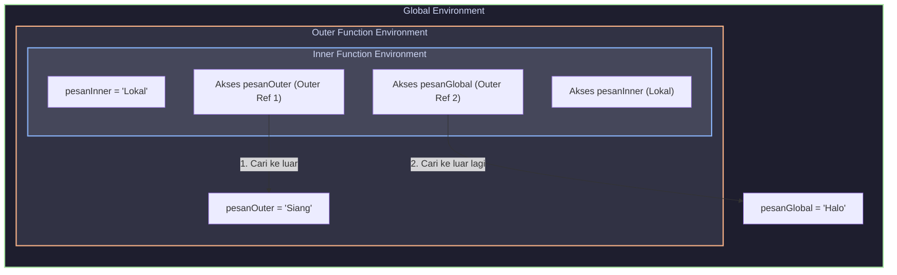

# Bab 03 — Lexical Scope dan Scope Chain

Bagaimana JavaScript tahu variabel mana yang harus dipakai ketika ada banyak fungsi yang saling bersarang? Mengapa posisi fisik penulisan fungsi menentukan segalanya? Di bab ini, kita akan membongkar konsep **Lexical Scope** dan cara kerja penelusuran **Scope Chain** di balik layar.

---

## Tujuan Bab
Setelah menyelesaikan bab ini, Anda akan:
*   Paham definisi **Lexical Scope** (Static Scope) sebagai penentuan scope berdasarkan tempat penulisan kode, bukan tempat pemanggilan fungsi.
*   Mengerti alur kerja penelusuran **Scope Chain** dari lingkup lokal hingga mencapai lingkup global.
*   Mampu menganalisis visualisasi tautan referensi luar (*outer reference*) pada runtime engine.
*   Melihat hubungan awal yang menjembatani konsep Lexical Scope dengan terciptanya **Closure**.

---

## Inti Cepat
> **Lexical Scope** berarti aturan akses variabel diputuskan seutuhnya pada saat kode **dikompilasi secara statis** (berdasarkan posisi tertulis Anda di editor), bukan saat runtime berjalan dinamis. **Scope Chain** adalah rantai penelusuran satu arah: jika variabel tidak ada di scope saat ini, JavaScript engine akan mendaki tautan referensi luar (*outer reference*) ke scope induknya, terus ke atas hingga mencapai scope Global.

---

## Masalah yang Diselesaikan
Jika JavaScript menggunakan *Dynamic Scope* (lawan dari Lexical Scope), di mana pencarian variabel didasarkan pada rantai panggilan fungsi (*Call Stack*) saat berjalan, maka program Anda akan sangat rapuh dan mustahil diprediksi secara statis. 

Perhatikan masalah dinamis berikut:
1.  **Ketidakpastian Akses:** Fungsi yang sama akan mengembalikan nilai yang berbeda tergantung dari fungsi mana ia dipanggil.
2.  **Kerusakan Enkapsulasi:** Variabel lokal di dalam fungsi penyerang dapat secara tidak sengaja "dibaca" oleh fungsi yang dipanggil jika mereka berada dalam rantai eksekusi yang sama.
3.  **Kesulitan Analisis Alat:** Code editor dan compiler tidak akan bisa memberikan peringatan dini (*warning*) jika ada variabel yang hilang karena penentuan scope baru diputuskan saat program berjalan (*runtime*).

Lexical Scope menyelesaikan ketidakpastian ini dengan mengunci pagar scope secara permanen berdasarkan posisi penulisan fisik kode Anda.

---

## Analogi
Bayangkan pencarian variabel seperti mencari resep makanan di dalam **Buku Catatan Resep**:

*   **Lokal Notebook (Scope Lokal):** Anda sedang berada di dapur Anda sendiri. Anda membuka catatan resep pribadi Anda yang ada di atas meja untuk mencari bumbu "garam".
*   **Induk Notebook (Outer Scope):** Jika resep rahasia "bumbu kari" tidak tertulis di catatan pribadi Anda, Anda tidak akan menyerah begitu saja. Anda membuka lemari dapur milik ibu Anda (yang mewariskan rumah itu kepada Anda) untuk melihat catatan resep miliknya.
*   **Global Library (Global Scope):** Jika masih tidak ada, Anda pergi ke perpustakaan umum kota (Global Scope) untuk mencari di buku resep nasional.

*Arahnya mutlak satu arah:* Anda hanya bisa mendaki ke catatan luar milik pihak yang menaungi Anda secara tertulis. Anda tidak boleh menengok ke dalam catatan pribadi milik tetangga sebelah rumah Anda secara acak.

---

## Batas Analogi
Analogi buku catatan resep membantu memahami alur penelusuran hierarkis dari dalam ke luar. Namun, analogi ini memiliki batas teknis:
*   Di dunia nyata, Anda bisa pergi mengunjungi tetangga atau menelepon teman untuk meminta resep (pencarian dinamis bebas).
*   Di JavaScript, scope chain bersifat **kaku dan statis**. Hubungan antar "buku catatan" terkunci mati sejak fungsi pertama kali dideklarasikan. Fungsi tidak dapat secara dinamis mengubah siapa "ibu/induk" dari scope-nya saat runtime, tidak peduli dari mana fungsi tersebut dipanggil.

---

## Penjelasan Naratif
"Lexical" berasal dari kata *lexing* (fase pemindaian saat kode Anda dianalisis oleh compiler). Lexical Scope berarti scope ditentukan secara statis di fase tersebut. 

Mari kita buat kesepakatan mental: **JavaScript menentukan scope suatu fungsi bukan berdasarkan di mana fungsi tersebut DIPANGGIL (*called*), melainkan di mana fungsi tersebut DITULIS (*defined*).**

Jika Anda mendeklarasikan fungsi `A` di level global, maka scope terluar dari `A` adalah global, titik. Walaupun Anda memanggil fungsi `A` dari dalam ruang bawah tanah fungsi `B` yang memiliki variabel lokal melimpah, fungsi `A` tetap tidak akan pernah bisa melihat variabel lokal milik `B`. `A` hanya memiliki akses ke scope lokalnya sendiri dan scope global di luarnya.

---

## Penjelasan Teknis
Ketika JavaScript engine membuat sebuah fungsi, secara internal engine akan menyematkan properti rahasia yang disebut **`[[Scopes]]`** pada objek fungsi tersebut. 

*   Properti `[[Scopes]]` ini bertindak sebagai "memori genetik" fungsi.
*   Ia menyimpan daftar seluruh *Lexical Environment* yang menaungi fungsi tersebut pada saat ia dilahirkan (dideklarasikan).
*   Ketika fungsi tersebut dieksekusi, engine membuat *Lexical Environment* lokal baru dan menetapkan tautan **`Outer Reference`** miliknya untuk menunjuk langsung ke lingkungan yang disimpan di dalam properti rahasia `[[Scopes]]` tersebut.

Inilah cara kerja **Scope Chain** yang sebenarnya. Scope chain adalah rantai fisik objek *Lexical Environment* yang terhubung satu sama lain melalui properti *Outer Reference* internal.

---

## Contoh Kode

Mari kita buktikan bahwa JavaScript melacak scope berdasarkan posisi penulisan, bukan posisi pemanggilan:

```javascript
const nama = "Budi (Global)";

function cetakNama() {
  // Ditulis di level global, maka Outer Reference-nya menunjuk ke Global Scope
  console.log(nama);
}

function eksekutor() {
  const nama = "Joko (Lokal Eksekutor)";
  
  // PENGUJIAN: Memanggil cetakNama dari dalam eksekutor
  cetakNama(); 
}

eksekutor();
```

---

## Bedah Kode
Mari kita analisis perilaku eksekusi kode di atas secara saksama:
1.  **Kompilasi Statis:** Engine memindai kode. Engine mencatat bahwa fungsi `cetakNama` dideklarasikan di level Global. Maka properti internal `cetakNama.[[Scopes]]` dikunci untuk menunjuk langsung ke *Global Lexical Environment*.
2.  **Pemanggilan `eksekutor()`:**
    *   Engine masuk ke fungsi `eksekutor`. Di dalam scope lokal `eksekutor`, dideklarasikan variabel `nama` baru bernilai `"Joko (Lokal Eksekutor)"`.
    *   Di dalam `eksekutor`, kita memanggil fungsi `cetakNama()`.
3.  **Eksekusi `cetakNama()`:**
    *   Engine masuk ke dalam fungsi `cetakNama`.
    *   Di dalam `cetakNama`, diperintahkan untuk mencetak variabel `nama` (`console.log(nama)`).
    *   Engine memeriksa *Environment Record* lokal milik `cetakNama`. Tidak ada variabel bernama `nama`.
    *   Engine mendaki **Scope Chain**. Melalui tautan *Outer Reference* (yang menunjuk ke *Global Environment* sesuai ingatan genetiknya saat ditulis, **bukan** ke environment `eksekutor`), engine memeriksa Global Environment.
    *   Di Global Environment, ditemukan variabel `nama` dengan nilai `"Budi (Global)"`.
    *   **Output yang dicetak:** `"Budi (Global)"`.

*Kesimpulan:* Meskipun `cetakNama` dipanggil di dalam `eksekutor` yang memiliki variabel `nama = "Joko"`, fungsi `cetakNama` sama sekali tidak terpengaruh oleh lingkungan `eksekutor` karena mereka tidak memiliki hubungan kekerabatan lexical.

---

## Cara Kerja di Balik Layar

Berikut adalah visualisasi hierarki tautan *Outer Reference* (Scope Chain) dari contoh kode di atas:

```text
[Global Environment]
- nama: "Budi (Global)"
- cetakNama: (Function)
- eksekutor: (Function)
      ^
      | (Outer Reference menunjuk langsung ke Global)
      |
+-----------------------------------+
| Lexical Environment (cetakNama)   |
| - Record: [Kosong]                |
+-----------------------------------+
      ^
      | (Outer Reference JUGA menunjuk langsung ke Global, BUKAN ke eksekutor!)
      |
+-----------------------------------+
| Lexical Environment (eksekutor)   |
| - Record: - nama: "Joko"          |
+-----------------------------------+
```

---

## Diagram / Simulasi
Mari kita visualisasikan rantai penelusuran scope chain satu arah pada fungsi bersarang (*nested functions*):



---

## Kesalahan Umum
Anomali pencarian variabel sering terjadi ketika developer lupa mendeklarasikan variabel dengan keyword `const`, `let`, atau `var` di dalam scope lokal, sehingga secara tidak sengaja mengubah nilai variabel luar yang memiliki nama sama:

```javascript
let namaKontak = "Andi";

function perbaruiKontak() {
  // BUG: Lupa menulis 'const' atau 'let' di depan namaKontak!
  namaKontak = "Siti"; 
  console.log("Kontak diperbarui lokal.");
}

console.log("Sebelum: " + namaKontak); // "Sebelum: Andi"
perbaruiKontak();
console.log("Setelah: " + namaKontak); // "Setelah: Siti" (Variabel Global Anda telah terpolusi dan rusak!)
```
*Mengapa ini terjadi?* 
Karena tidak ada `const/let` di dalam fungsi, engine tidak membuat variabel baru di scope lokal `perbaruiKontak`. Engine mendaki scope chain ke scope global, menemukan variabel `namaKontak` milik global, dan langsung menimpa nilainya dengan `"Siti"`.

---

## Contoh Project
Berikut adalah modul otentikasi sederhana yang memanfaatkan Lexical Scope statis untuk menjaga integritas fungsi otentikasi tanpa khawatir variabel konfigurasi ditimpa saat dieksekusi di runtime eksternal:

```javascript
// File: secureAuth.js
const API_URL = "https://api.produksi.com/v1";

function createAuthenticator(serviceName) {
  // Lexical Scope mengunci URL dan nama servis di dalam fungsi ini
  return function authenticate(userCredentials) {
    console.log(`Mengirim kredensial untuk layanan: ${serviceName}`);
    console.log(`Menghubungi endpoint: ${API_URL}/auth`);
    // Proses otentikasi aman terisolasi...
  };
}

const loginKeGoogle = createAuthenticator("Google OAuth");

// Di bagian lain dari aplikasi, ada yang mencoba mengubah API_URL secara dinamis di level eksternal
(function kodePihakKetiga() {
  const API_URL = "https://api.palsu-peretas.com/v1";
  
  // Memanggil fungsi login Google dari sini
  loginKeGoogle({ user: "budi", pass: "rahasia" });
  // Output:
  // "Mengirim kredensial untuk layanan: Google OAuth"
  // "Menghubungi endpoint: https://api.produksi.com/v1/auth" (Tetap aman ke API produksi!)
})();
```

---

## Latihan

### Soal Prediksi Output: Nested Functions
Perhatikan dengan saksama struktur fungsi bersarang di bawah ini:

```javascript
const nilai = 10;

function induk() {
  const nilai = 20;
  
  function anak() {
    console.log(nilai);
  }
  
  return anak;
}

const jalankanAnak = induk();
const nilai = 30; // Apakah baris ini berpengaruh? (Ingat aturan const redeclaration di scope yang sama)
jalankanAnak(); 
```

**Pertanyaan:**
1. Apakah pendeklarasikan ulang konstanta `nilai` di baris terakhir akan menyebabkan error sintaksis? Jelaskan mengapa!
2. Jika konstanta di baris terakhir diubah namanya menjadi variabel lain sehingga tidak error, output angka berapakah yang akan dicetak di konsol saat `jalankanAnak()` dipanggil? 10, 20, atau 30?
3. Jelaskan langkah demi langkah pencarian scope (*scope chain lookup*) yang dilakukan oleh JavaScript engine hingga berhasil menemukan nilai tersebut!

---

## Ringkasan
*   **Lexical Scope:** Hubungan antar scope diputuskan secara statis saat penulisan kode (compile time), bukan saat pemanggilan (runtime).
*   **Scope Chain Lookup:** Proses pencarian variabel berjalan secara **satu arah ke luar** dari scope lokal $\rightarrow$ outer scope $\rightarrow$ global scope.
*   **Ingatan Genetik (`[[Scopes]]`):** Setiap fungsi mengingat lingkungan tempat ia ditulis secara permanen melalui properti rahasia internal.
*   **Outer Reference:** Pointer runtime yang menghubungkan satu *Lexical Environment* ke lingkungan di luarnya untuk membentuk rantai pencarian (*scope chain*).

---

## Lanjut ke Mana
Selamat! Anda telah menguasai tiga pilar utama scope: esensi scope, klasifikasi daerah scope, serta mekanisme lexical scope chain. Pemahaman mendalam ini adalah kunci emas utama untuk membuka gerbang misteri terbesar di JavaScript: **Closures**. Di Buku 2 berikutnya, kita akan mengungkap bagaimana fungsi dapat "membawa pergi" variabel yang seharusnya sudah mati di memori setelah fungsinya selesai dipanggil!
